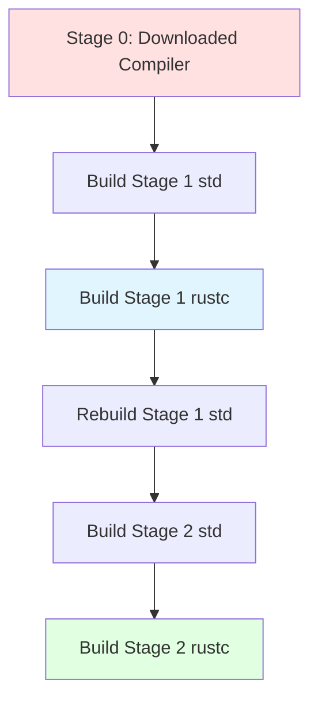

The Rust bootstrap system (`src/bootstrap/`) manages the complex process of building a self-hosting compiler. Since Rust is written in Rust, a sophisticated bootstrapping mechanism is required.

## The Bootstrap Problem

<Note>
**The fundamental challenge**: How do you compile a Rust compiler when you need a Rust compiler to compile Rust code?

**The solution**: Use a previously-built compiler (stage 0) to compile the current source code (stage 1), then use that to recompile itself (stage 2) for verification.
</Note>

## Three-Stage Bootstrap Process

From `src/bootstrap/README.md`:

> Bootstrap build system goes through a few phases to actually build the compiler.

<Steps>
  <Step title="Stage 0: Download Prebuilt Compiler">
    The entry point script (`x`, `x.ps1`, or `x.py`) downloads prebuilt compiler binaries:
    
    ```bash
    # Entry point scripts
    ./x        # Unix-like systems
    ./x.ps1    # Windows PowerShell
    ./x.py     # Cross-platform Python
    ```
    
    These scripts:
    - Download the stage 0 compiler/Cargo binaries from CI
    - Extract them to `build/<host-triple>/stage0/`
    - Compile the bootstrap system itself
    - Invoke the compiled bootstrap binary
  </Step>
  
  <Step title="Stage 1: Build with Stage 0">
    Use the prebuilt stage 0 compiler to build the current source:
    
    1. Build the stage 1 standard library using stage 0
    2. Build the stage 1 compiler (links against stage 0 std)
    3. Use stage 1 compiler to rebuild the stage 1 standard library
    
    Output: A working compiler in `build/<host-triple>/stage1/`
  </Step>
  
  <Step title="Stage 2: Rebuild with Stage 1">
    Use the stage 1 compiler to rebuild everything:
    
    1. Build the stage 2 standard library using stage 1
    2. Build the stage 2 compiler (links against stage 1 std)
    
    Output: A verified compiler in `build/<host-triple>/stage2/`
    
    <Info>
    Stage 2 ensures the compiler can compile itself correctly. This is the compiler distributed to users.
    </Info>
  </Step>
</Steps>



## Bootstrap System Architecture

### Entry Points

The bootstrap system has multiple entry points:

<Tabs>
  <Tab title="bootstrap.py">
    **bootstrap.py** is the Python entry point:
    
    ```python
    # Responsibilities:
    # 1. Download stage0 compiler if needed
    # 2. Compile the bootstrap binary
    # 3. Execute the bootstrap binary
    ```
    
    Location: `src/bootstrap/bootstrap.py`
    
    This is the "outer" bootstrap - it bootstraps the bootstrap!
  </Tab>
  
  <Tab title="x / x.ps1 / x.py">
    Convenience wrapper scripts:
    
    ```bash
    ./x build             # Build the compiler
    ./x test              # Run tests
    ./x doc               # Generate documentation
    ./x install           # Install the compiler
    ```
    
    These scripts invoke `bootstrap.py` with the appropriate arguments.
  </Tab>
  
  <Tab title="Bootstrap Binary">
    The main bootstrap binary:
    
    ```toml
    [[bin]]
    name = "bootstrap"
    path = "src/bin/main.rs"
    ```
    
    This is the "inner" bootstrap written in Rust that performs the actual multi-stage build.
  </Tab>
</Tabs>

### Bootstrap Crate Structure

```toml
[package]
name = "bootstrap"
version = "0.0.0"
edition = "2024"
default-run = "bootstrap"

[lib]
path = "src/lib.rs"

[[bin]]
name = "bootstrap"
path = "src/bin/main.rs"

[[bin]]
name = "rustc"          # Wrapper for stage0 rustc
path = "src/bin/rustc.rs"

[[bin]]
name = "rustdoc"        # Wrapper for stage0 rustdoc  
path = "src/bin/rustdoc.rs"
```

<Info>
Bootstrap includes wrapper binaries for rustc and rustdoc to intercept and instrument compilation during the build process.
</Info>

### Source Organization

The bootstrap source is organized in `src/bootstrap/src/`:

```
src/bootstrap/src/
├── lib.rs              # Main library entry point
├── bin/
│   ├── main.rs         # Bootstrap binary
│   ├── rustc.rs        # rustc wrapper
│   └── rustdoc.rs      # rustdoc wrapper
├── core/               # Core bootstrap functionality
│   ├── build_steps/    # Build step implementations
│   ├── builder/        # Build orchestration
│   ├── config/         # Configuration parsing
│   ├── download.rs     # Downloading artifacts
│   ├── sanity.rs       # Sanity checks
│   └── ...
└── utils/              # Utility modules
```

### Build Steps

Bootstrap organizes compilation into discrete build steps in `src/core/build_steps/`:

<CardGroup cols={2}>
  <Card title="compile.rs" icon="gear">
    Compiling rustc and the standard library
    
    - Std compilation
    - Rustc compilation
    - Tool compilation
  </Card>
  
  <Card title="check.rs" icon="circle-check">
    Fast checking without codegen
    
    - `cargo check` integration
    - Faster feedback
  </Card>
  
  <Card title="test.rs" icon="flask">
    Test suite execution
    
    - Compiletest harness
    - Unit tests
    - Integration tests
    - UI tests
  </Card>
  
  <Card title="doc.rs" icon="book">
    Documentation generation
    
    - Rustdoc invocation
    - Book building
    - API documentation
  </Card>
  
  <Card title="dist.rs" icon="box">
    Creating distribution artifacts
    
    - Tarball creation
    - Installation packages
    - Cross-compilation
  </Card>
  
  <Card title="install.rs" icon="download">
    Installing to system
    
    - System installation
    - Sysroot setup
  </Card>
  
  <Card title="llvm.rs" icon="microchip">
    Building LLVM
    
    - LLVM compilation
    - CMake integration
    - Caching
  </Card>
  
  <Card title="clippy.rs" icon="magnifying-glass">
    Running Clippy linter
  </Card>
  
  <Card title="tool.rs" icon="wrench">
    Building tools
    
    - rustfmt
    - cargo
    - Other tools
  </Card>
</CardGroup>

## Build Directory Structure

From `src/bootstrap/README.md`, all output goes under `build/`:

```
build/
├── cache/                          # Downloaded stage0 tarballs
│   ├── 2015-12-19/
│   ├── 2016-01-15/
│   └── ...
│
├── bootstrap/                      # Bootstrap binary itself
│   ├── debug/
│   └── release/
│
├── misc-tools/                     # Host-only tools
│   ├── bin/
│   └── target/
│
├── node_modules/                   # JS dependencies
│   └── .bin/
│
├── dist/                           # Distribution artifacts
│
├── tmp/                            # Temporary files
│
└── <host-triple>/                  # Per-host build artifacts
    ├── stage0/                     # Extracted stage0 compiler
    │   ├── bin/
    │   │   ├── rustc
    │   │   └── cargo
    │   └── lib/
    │
    ├── stage0-sysroot/             # Stage0 sysroot for building stage1
    │   └── lib/
    │
    ├── stage1/                     # Stage1 compiler sysroot
    │   ├── bin/
    │   │   └── rustc
    │   └── lib/
    │
    ├── stage2/                     # Stage2 compiler sysroot
    │   ├── bin/
    │   │   └── rustc
    │   └── lib/
    │
    ├── stageN-std/                 # Cargo output for std
    ├── stageN-test/                # Cargo output for test
    ├── stageN-rustc/               # Cargo output for rustc
    ├── stageN-tools/               # Cargo output for tools
    │
    ├── llvm/                       # LLVM build
    │   ├── build/
    │   ├── bin/
    │   ├── lib/
    │   └── include/
    │
    ├── compiler-rt/                # Compiler runtime
    │   └── build/
    │
    ├── doc/                        # Generated documentation
    │
    ├── test/                       # Test outputs
    │   ├── ui/
    │   ├── debuginfo/
    │   └── ...
    │
    └── bootstrap-tools/            # Host tools (stage0)
```

<Note>
The build system uses hard links when possible to avoid copying large artifacts between stage directories.
</Note>

## Configuration

Bootstrap is configured through multiple mechanisms:

<Tabs>
  <Tab title="config.toml">
    Main configuration file `config.toml` (or `bootstrap.toml`):
    
    ```toml
    [build]
    # Number of parallel jobs
    jobs = 8
    
    # Target triples to build
    target = ["x86_64-unknown-linux-gnu"]
    
    # Host triples
    host = ["x86_64-unknown-linux-gnu"]
    
    [rust]
    # Optimization level
    optimize = true
    
    # Debug info
    debug = true
    
    # Use incremental compilation
    incremental = true
    
    [llvm]
    # Download prebuilt LLVM
    download-ci-llvm = true
    ```
  </Tab>
  
  <Tab title="Command Line">
    Command-line arguments override config file:
    
    ```bash
    ./x build --stage 1           # Build only stage 1
    ./x build --jobs 4            # Override job count
    ./x test --stage 1 compiler   # Test stage 1 compiler
    ./x doc --open                # Build and open docs
    ```
  </Tab>
  
  <Tab title="Environment Variables">
    Environment variables for advanced control:
    
    ```bash
    RUST_BACKTRACE=1              # Enable backtraces
    RUSTFLAGS="-C opt-level=3"    # Pass flags to rustc
    CARGOFLAGS="--verbose"        # Pass flags to cargo
    ```
  </Tab>
</Tabs>

Configuration is parsed in `src/core/config/`:

- **config.rs**: Main configuration struct
- **flags.rs**: Command-line flag parsing

## Dependency Management

Bootstrap has pinned dependencies for reliability:

```toml
[dependencies]
# Pinned to prevent breakage
cc = "=1.2.28"
cmake = "=0.1.54"

# Build utilities
build_helper = { path = "../build_helper" }
clap = { version = "4.4" }
serde = "1.0"
serde_json = "1.0"
toml = "0.5"

# Platform operations
tar = { version = "0.4.44" }
xz2 = "0.1"
sha2 = "0.10"
```

<Accordion title="Why Pinned Dependencies?">
  From `Cargo.toml` comments:
  
  > Most of the time updating these dependencies requires modifications to the
  > bootstrap codebase (e.g., https://github.com/rust-lang/rust/issues/124565);
  > otherwise, some targets will fail. That's why these dependencies are explicitly pinned.
</Accordion>

## Build Performance Optimizations

### Compilation Speed

<CardGroup cols={2}>
  <Card title="No Debug Info for Deps" icon="gauge-high">
    ```toml
    [profile.dev]
    debug = 0  # No debug info for dependencies
    
    [profile.dev.package.bootstrap]
    debug = 1  # Only for bootstrap itself
    ```
  </Card>
  
  <Card title="Incremental Bootstrap" icon="arrows-rotate">
    Bootstrap leverages Cargo's incremental compilation:
    - Only recompile changed crates
    - Cache build artifacts
    - Parallel compilation
  </Card>
</CardGroup>

### Downloading Pre-built Artifacts

<Tabs>
  <Tab title="LLVM">
    Pre-built LLVM can be downloaded instead of building:
    
    ```toml
    [llvm]
    download-ci-llvm = true
    ```
    
    Managed by `src/core/download.rs`:
    - Downloads from CI artifacts
    - Verifies checksums (SHA-256)
    - Caches in `build/cache/`
  </Tab>
  
  <Tab title="Stage 0">
    Stage 0 compiler is always downloaded:
    
    - Version specified in `src/stage0`
    - Downloaded from https://static.rust-lang.org/
    - Cached to avoid re-downloading
  </Tab>
</Tabs>

## Sanity Checks

`src/core/sanity.rs` performs extensive validation:

<Steps>
  <Step title="Verify Toolchains">
    - Check for C/C++ compiler
    - Verify linker is available
    - Confirm CMake for LLVM builds
    - Check Python version
  </Step>
  
  <Step title="Validate Paths">
    - Ensure source directories exist
    - Verify build directory is writable
    - Check stage0 compiler
  </Step>
  
  <Step title="Check Configuration">
    - Validate target triples
    - Verify feature compatibility
    - Confirm LLVM settings
  </Step>
</Steps>

## Parallel Execution

Bootstrap orchestrates parallel builds:

<Info>
The `-j` parameter to bootstrap gets forwarded to Cargo and test harnesses for parallel execution.
</Info>

```bash
./x build -j 8  # Use 8 parallel jobs
```

Orchestration in `src/core/builder/`:
- Dependency graph construction
- Parallel step execution
- Resource management

## Testing Infrastructure

`test.rs` implements the test infrastructure:

<Tabs>
  <Tab title="Test Suites">
    Multiple test suites:
    
    - **UI tests**: Compiler diagnostic tests
    - **Codegen tests**: Code generation verification
    - **Assembly tests**: Assembly output tests
    - **Debuginfo tests**: Debug information tests
    - **Incremental tests**: Incremental compilation tests
    - **Rustdoc tests**: Documentation tests
    - **Unit tests**: Compiler unit tests
  </Tab>
  
  <Tab title="Compiletest">
    **compiletest** is the test harness:
    
    Located in `src/tools/compiletest/`
    
    Features:
    - Parallel test execution
    - Expected output comparison
    - Test filtering
    - Platform-specific tests
  </Tab>
  
  <Tab title="Running Tests">
    ```bash
    ./x test                      # Run all tests
    ./x test --stage 1            # Test with stage 1 compiler
    ./x test compiler             # Test compiler crates
    ./x test src/test/ui          # Run UI tests
    ./x test --test-args --nocapture  # Pass args to test runner
    ```
  </Tab>
</Tabs>

## Cross-Compilation Support

Bootstrap supports building for multiple targets:

```toml
[build]
host = ["x86_64-unknown-linux-gnu"]
target = [
  "x86_64-unknown-linux-gnu",
  "aarch64-unknown-linux-gnu",
  "x86_64-pc-windows-gnu",
]
```

Each target gets its own build directory under `build/<host-triple>/`.

## Distribution Creation

`dist.rs` creates distribution artifacts:

<Steps>
  <Step title="Component Packaging">
    - Package rustc binary
    - Package standard library
    - Package documentation
    - Package tools (cargo, clippy, rustfmt)
  </Step>
  
  <Step title="Tarball Creation">
    - Create tar.xz archives
    - Generate manifests
    - Calculate checksums
  </Step>
  
  <Step title="Installation Packages">
    - rustup-compatible packages
    - Platform-specific installers
  </Step>
</Steps>

Output in `build/dist/`.

## Extending Bootstrap

From the README:

> Some general areas that you may be interested in modifying:

<AccordionGroup>
  <Accordion title="Adding a New Tool">
    See `bootstrap/src/core/build_steps/tool.rs` for examples.
    
    Steps:
    1. Define a new step struct
    2. Implement the `Step` trait
    3. Register in the builder
  </Accordion>
  
  <Accordion title="Adding a Compiler Crate">
    1. Create directory with `Cargo.toml`
    2. Configure all `Cargo.toml` files
    3. Add to workspace members
    
    No bootstrap changes needed!
  </Accordion>
  
  <Accordion title="Adding Configuration Option">
    1. Modify `bootstrap/src/core/config/flags.rs` for CLI flags
    2. Modify `bootstrap/src/core/config/config.rs` for config struct
    3. Update `CONFIG_CHANGE_HISTORY` in `src/utils/change_tracker.rs`
  </Accordion>
  
  <Accordion title="Adding Sanity Check">
    Add to `bootstrap/src/core/sanity.rs`
  </Accordion>
</AccordionGroup>

## Two Codebases in Sync

<Warning>
Bootstrap has two separate codebases that must stay synchronized:

1. **bootstrap.py** (Python)
2. **bootstrap binary** (Rust)

Both parse `bootstrap.toml` and command-line arguments. They communicate via environment variables.
</Warning>

Synchronization mechanisms:
- Environment variables set by `bootstrap.py`
- Explicitly ignored arguments
- Shared configuration format

## Platform-Specific Handling

Bootstrap handles platform differences:

<Tabs>
  <Tab title="Windows">
    ```toml
    [target.'cfg(windows)'.dependencies]
    junction = "1.3.0"    # Junction/symlink support
    windows = { version = "0.61", features = [...] }
    ```
    
    Windows-specific:
    - Different file extensions (.exe)
    - Path separators
    - Junction support
  </Tab>
  
  <Tab title="Unix">
    Standard Unix conventions:
    - Shell scripts (./x)
    - Standard paths
    - Symlinks
  </Tab>
</Tabs>

## Debugging Bootstrap

<Steps>
  <Step title="Enable Verbose Output">
    ```bash
    ./x build --verbose
    ./x build -vv  # Very verbose
    ```
  </Step>
  
  <Step title="Inspect Build Commands">
    Bootstrap prints Cargo invocations in verbose mode.
  </Step>
  
  <Step title="Test Bootstrap Itself">
    ```bash
    ./x test bootstrap
    ```
    
    Uses snapshot testing with `cargo-insta`:
    ```bash
    cargo install cargo-insta
    cargo insta review --manifest-path src/bootstrap/Cargo.toml
    ```
  </Step>
</Steps>

## Change Tracking

Bootstrap tracks configuration changes in `src/utils/change_tracker.rs`:

<Info>
Add entries to `CONFIG_CHANGE_HISTORY` when making major changes:
- New configuration options
- Changes to default behavior
- Breaking configuration changes
</Info>

## Design Philosophy

<CardGroup cols={2}>
  <Card title="Leverage Cargo" icon="anchor">
    Defer most compilation logic to Cargo itself
  </Card>
  
  <Card title="Incremental by Default" icon="forward">
    Each build step is incremental and parallelizable
  </Card>
  
  <Card title="Hard Links" icon="link">
    Use hard links instead of copying to save space
  </Card>
  
  <Card title="Fail Fast" icon="circle-exclamation">
    Sanity checks catch problems early
  </Card>
</CardGroup>

## Common Build Commands

```bash
# Build stage 1 compiler (faster for development)
./x build --stage 1

# Build stage 2 compiler (for distribution)
./x build --stage 2

# Build only the standard library
./x build --stage 1 library/std

# Check without building
./x check

# Run tests
./x test

# Build documentation
./x doc

# Clean build artifacts
./x clean

# Install to system
./x install
```

## Further Reading

<CardGroup cols={2}>
  <Card title="Compiler Architecture" icon="microchip" href="/architecture/compiler">
    What bootstrap compiles: the compiler crates
  </Card>
  <Card title="Standard Library" icon="book" href="/architecture/standard-library">
    The standard library built by bootstrap
  </Card>
  <Card title="rustc dev guide" icon="external-link">
    Building rustc: https://rustc-dev-guide.rust-lang.org/building/bootstrapping/
  </Card>
  <Card title="Contributing" icon="users">
    CONTRIBUTING.md in the repository
  </Card>
</CardGroup>
