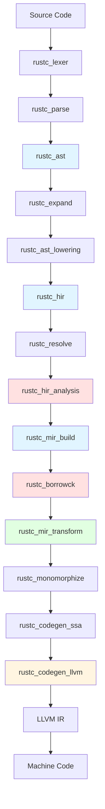

The Rust compiler (rustc) is implemented as a collection of 74+ specialized crates in the `compiler/` directory. Each crate handles a specific phase of compilation or provides shared infrastructure.

## Compiler Overview

<Info>
The compiler follows a traditional multi-pass design with three distinct intermediate representations (AST, HIR, MIR) before final code generation.
</Info>

### Main Entry Points

<CardGroup cols={3}>
  <Card title="rustc" icon="terminal">
    Binary wrapper that invokes the compiler driver
  </Card>
  <Card title="rustc_driver" icon="steering-wheel">
    Thin wrapper around rustc_driver_impl
  </Card>
  <Card title="rustc_driver_impl" icon="gears">
    Main compiler driver coordinating all compilation phases
  </Card>
</CardGroup>

The `rustc_driver_impl` crate orchestrates the entire compilation pipeline and depends on 30+ other compiler crates:

```rust
// Key dependencies from rustc_driver_impl/Cargo.toml
rustc_ast
rustc_ast_pretty
rustc_codegen_ssa
rustc_const_eval
rustc_data_structures
rustc_errors
rustc_expand
rustc_hir_analysis
rustc_interface
rustc_metadata
rustc_middle
rustc_mir_build
rustc_mir_transform
rustc_parse
rustc_resolve
rustc_session
// ... and more
```

## Compilation Pipeline

The compilation process flows through distinct phases, each implemented by specialized crates:

### Phase 1: Lexical Analysis and Parsing

<Steps>
  <Step title="Lexing">
    **rustc_lexer** converts source text into a stream of tokens.
    
    - No dependencies on other rustc crates
    - Pure function from `&str` to tokens
    - Handles all Rust syntax including raw strings, byte literals, etc.
  </Step>
  
  <Step title="Parsing">
    **rustc_parse** builds the Abstract Syntax Tree (AST).
    
    Dependencies:
    - `rustc_ast`: AST data structures
    - `rustc_lexer`: Token stream
    - `rustc_errors`: Diagnostic reporting
    - `rustc_span`: Source location tracking
  </Step>
  
  <Step title="AST Representation">
    **rustc_ast** defines the AST data structures and provides utilities for working with them.
    
    From `compiler/rustc_ast/README.md`:
    > The `rustc_ast` crate contains those things concerned purely with syntax
    > – that is, the AST ("abstract syntax tree"), along with some definitions
    > for tokens and token streams, data structures/traits for mutating ASTs,
    > and shared definitions for other AST-related parts of the compiler.
  </Step>
</Steps>

<Accordion title="AST-Related Crates">
  - **rustc_ast**: Core AST definitions
  - **rustc_ast_ir**: Shared IR infrastructure between AST and HIR
  - **rustc_ast_lowering**: Converts AST to HIR
  - **rustc_ast_passes**: Early semantic checks on AST
  - **rustc_ast_pretty**: Pretty-printing AST back to source
  - **rustc_parse_format**: Parsing format strings (for `format!`, `println!`, etc.)
</Accordion>

### Phase 2: Name Resolution and HIR

<Steps>
  <Step title="AST to HIR Lowering">
    **rustc_ast_lowering** converts the AST to High-Level Intermediate Representation (HIR).
    
    HIR is a desugared, name-resolved version of the AST:
    - Removes syntactic sugar
    - Resolves identifiers to their definitions
    - Simplifies pattern matching
    - Normalizes control flow
  </Step>
  
  <Step title="Name Resolution">
    **rustc_resolve** performs name resolution.
    
    - Resolves all identifiers to definitions
    - Handles imports and visibility
    - Builds the name resolution tables
    - Detects name conflicts and ambiguities
  </Step>
  
  <Step title="HIR Representation">
    **rustc_hir** defines the HIR data structures.
    
    Supporting crates:
    - **rustc_hir_id**: HIR node identification
    - **rustc_hir_pretty**: Pretty-printing HIR
  </Step>
</Steps>

### Phase 3: Type Checking and Analysis

<Tabs>
  <Tab title="Type Analysis">
    **rustc_hir_analysis** performs type checking and trait resolution.
    
    Key responsibilities:
    - Type inference
    - Trait solving
    - Well-formedness checking
    - Type parameter bounds checking
    
    **rustc_hir_typeck** handles detailed type checking:
    - Expression type checking
    - Method resolution
    - Coercion handling
  </Tab>
  
  <Tab title="Trait System">
    **rustc_trait_selection** implements the trait solver.
    
    - Selects trait implementations
    - Handles associated types
    - Resolves auto traits
    - Manages coherence checking
    
    **rustc_traits** provides trait-related queries.
    
    **rustc_next_trait_solver** is the next-generation trait solver implementation.
  </Tab>
  
  <Tab title="Type System Core">
    **rustc_middle** is the central hub containing:
    - Type definitions (`ty` module)
    - MIR definitions
    - Query system integration
    - Shared compiler state
    
    **rustc_type_ir** provides type system abstractions.
    
    **rustc_ty_utils** contains type-related utility functions.
  </Tab>
</Tabs>

### Phase 4: MIR Generation and Optimization

<Steps>
  <Step title="MIR Construction">
    **rustc_mir_build** builds the Mid-Level Intermediate Representation (MIR).
    
    MIR is a control-flow graph representation:
    - Basic blocks with terminators
    - Explicit control flow
    - Explicit drops and unwinding
    - Suitable for optimization and analysis
  </Step>
  
  <Step title="Borrow Checking">
    **rustc_borrowck** implements Rust's ownership and borrowing rules.
    
    This is where Rust's memory safety guarantees are enforced:
    - Lifetime checking
    - Borrow tracking
    - Move semantics
    - Non-Lexical Lifetimes (NLL)
  </Step>
  
  <Step title="Constant Evaluation">
    **rustc_const_eval** evaluates constants at compile time.
    
    - Const function evaluation
    - Static initialization
    - Compile-time computation
    - Pattern matching exhaustiveness
  </Step>
  
  <Step title="MIR Optimization">
    **rustc_mir_transform** performs MIR-level optimizations.
    
    Optimizations include:
    - Inlining
    - Dead code elimination
    - Constant propagation
    - Simplification passes
  </Step>
</Steps>

<Note>
MIR is central to Rust's compilation model. It's the representation where borrow checking, optimization, and most analyses occur.
</Note>

### Phase 5: Code Generation

<CardGroup cols={2}>
  <Card title="Monomorphization" icon="clone">
    **rustc_monomorphize** generates concrete versions of generic code.
    
    - Instantiates generic functions
    - Performs collection of items to codegen
    - Handles specialization
  </Card>
  
  <Card title="Code Generation" icon="code">
    **rustc_codegen_ssa** provides the shared codegen abstraction.
    
    Backend implementations:
    - **rustc_codegen_llvm**: LLVM backend (default)
    - **rustc_codegen_cranelift**: Cranelift backend
    - **rustc_codegen_gcc**: GCC backend
  </Card>
</CardGroup>

#### LLVM Backend

**rustc_codegen_llvm** is the default code generation backend:

```toml
# Optional dependency in rustc_interface
rustc_codegen_llvm = { path = "../rustc_codegen_llvm", optional = true }
```

Supporting LLVM integration:
- **rustc_llvm**: LLVM C++ bindings

#### Alternative Backends

The compiler supports alternative backends for different use cases:

- **Cranelift**: Faster compilation times, less optimization
- **GCC**: Platform support through GCC

## Supporting Infrastructure

### Data Structures and Utilities

<AccordionGroup>
  <Accordion title="Core Data Structures">
    **rustc_data_structures** provides specialized compiler data structures:
    
    - `Interner`: String interning
    - `IndexVec`: Indexed vector types
    - `FxHashMap`/`FxHashSet`: Fast hashing collections
    - `Fingerprint`: For incremental compilation
    - Graph data structures
    - Persistent data structures
  </Accordion>
  
  <Accordion title="Indexing">
    **rustc_index** defines newtype indices for type-safe indexing:
    
    - `DefId`: Definition identifiers
    - `LocalDefId`: Local definition identifiers
    - `HirId`: HIR node identifiers
    - Various other index types
    
    **rustc_index_macros** provides macros for index types.
  </Accordion>
  
  <Accordion title="Hashing">
    **rustc_hashes** provides specialized hash implementations:
    
    - Fast, non-cryptographic hashing
    - Stable hashing for incremental compilation
  </Accordion>
  
  <Accordion title="Arena Allocation">
    **rustc_arena** provides arena allocators for efficient memory management:
    
    - Batch allocation/deallocation
    - Reduced memory fragmentation
    - Improved cache locality
  </Accordion>
</AccordionGroup>

### Error Handling and Diagnostics

<Tabs>
  <Tab title="Error Infrastructure">
    **rustc_errors** implements comprehensive error reporting:
    
    - Multi-span diagnostics
    - Structured suggestions
    - Error formatting and styling
    - JSON output for tools
    
    **rustc_error_codes** defines all compiler error codes.
    
    **rustc_error_messages** manages error message localization.
  </Tab>
  
  <Tab title="Source Tracking">
    **rustc_span** tracks source code locations:
    
    - `Span`: Source code regions
    - `Symbol`: Interned strings
    - Source file management
    - Macro expansion tracking
  </Tab>
</Tabs>

### Metadata and Linking

<CardGroup cols={2}>
  <Card title="Metadata" icon="database">
    **rustc_metadata** handles crate metadata:
    
    - Reading compiled crate metadata
    - Writing metadata to rlibs
    - Dependency tracking
    - Cross-crate information
  </Card>
  
  <Card title="Symbol Mangling" icon="shuffle">
    **rustc_symbol_mangling** generates mangled symbol names:
    
    - Name mangling for linker
    - Demangling support
    - Symbol versioning
  </Card>
</CardGroup>

### Session and Configuration

**rustc_session** manages compilation session state:

```rust
// Core session information
- Compiler options (optimization level, target, etc.)
- Feature gates and stability tracking
- Source file mapping
- Diagnostic emitter
- Target information
```

**rustc_target** defines target platform information:
- Target triples
- ABI specifications
- Calling conventions
- Platform-specific details

**rustc_abi** handles ABI-related types and computations.

### Feature Management

**rustc_feature** manages language features:
- Stable features
- Unstable features
- Feature gates
- Edition-based features

**rustc_attr_parsing** parses attributes and feature gates.

### Incremental Compilation

<Steps>
  <Step title="Query System">
    **rustc_query_impl** implements the query system for demand-driven compilation:
    
    - On-demand computation
    - Automatic dependency tracking
    - Result caching
    - Incremental recompilation
  </Step>
  
  <Step title="Incremental State">
    **rustc_incremental** manages incremental compilation state:
    
    - Dependency graph persistence
    - Change detection
    - Work product caching
  </Step>
</Steps>

### Macros and Expansion

<Tabs>
  <Tab title="Macro Expansion">
    **rustc_expand** implements macro expansion:
    
    - Declarative macros (`macro_rules!`)
    - Procedural macros
    - Built-in macros
    - Derive macros
    
    **rustc_builtin_macros** implements built-in macros like:
    - `println!`, `format!`
    - `assert!`, `debug_assert!`
    - `include!`, `include_str!`
    - `cfg!`, `env!`
  </Tab>
  
  <Tab title="Proc Macros">
    **rustc_proc_macro** is an empty placeholder crate.
    
    The actual proc_macro support is in:
    - `library/proc_macro`: The proc_macro crate
    - `rustc_expand`: Proc macro expansion
  </Tab>
</Tabs>

### Platform-Specific Crates

<AccordionGroup>
  <Accordion title="Sanitizers">
    **rustc_sanitizers** integrates with LLVM sanitizers:
    - AddressSanitizer
    - ThreadSanitizer
    - MemorySanitizer
    - Leak Sanitizer
  </Accordion>
  
  <Accordion title="Windows Support">
    **rustc_windows_rc** handles Windows resource files.
  </Accordion>
  
  <Accordion title="Internationalization">
    **rustc_baked_icu_data** contains embedded ICU data for Unicode operations.
  </Accordion>
</AccordionGroup>

### Utility Crates

<CardGroup cols={3}>
  <Card title="Filesystem" icon="folder">
    **rustc_fs_util**
    
    Filesystem utilities for the compiler
  </Card>
  
  <Card title="Logging" icon="file-lines">
    **rustc_log**
    
    Logging infrastructure
  </Card>
  
  <Card title="Graphviz" icon="diagram-project">
    **rustc_graphviz**
    
    Graphviz output generation
  </Card>
  <Card title="Macros" icon="wand-magic-sparkles">
    **rustc_macros**
    
    Internal macros for compiler development
  </Card>
  
  <Card title="Serialization" icon="floppy-disk">
    **rustc_serialize**
    
    Custom serialization for compiler types
  </Card>
  
  <Card title="Threading" icon="layer-group">
    **rustc_thread_pool**
    
    Thread pool for parallel compilation
  </Card>
</CardGroup>

### Analysis and Checking

**rustc_passes** implements various compiler passes:
- Liveness analysis
- Stability checking
- Reachability analysis
- Entry point detection

**rustc_privacy** checks privacy rules and visibility.

**rustc_lint** implements the linting framework:
- Built-in lints
- Lint attributes
- Lint levels
- Custom lint infrastructure

**rustc_lint_defs** defines lint declarations.

### Pattern Matching

**rustc_pattern_analysis** implements pattern matching analysis:
- Exhaustiveness checking
- Usefulness checking
- Reachability analysis

### Type System Transmutation

**rustc_transmute** handles safe transmutation analysis for the `transmute` intrinsic.

## Public API

**rustc_public** and **rustc_public_bridge** provide stable APIs for external tools:

<Info>
These crates enable stable MIR consumers to interact with the compiler without depending on unstable internals.
</Info>

## Compilation Flow Diagram



<Note>
- **Blue**: AST/HIR/MIR construction
- **Red**: Type checking and borrow checking
- **Green**: Optimization
- **Yellow**: Code generation
</Note>

## Key Takeaways

<CardGroup cols={2}>
  <Card title="Modular Design" icon="puzzle-piece">
    74+ specialized crates, each with a single responsibility
  </Card>
  <Card title="Three IRs" icon="layer-group">
    AST → HIR → MIR pipeline enables different analyses at appropriate levels
  </Card>
  <Card title="Query-Based" icon="database">
    Demand-driven compilation with automatic dependency tracking
  </Card>
  <Card title="Backend Agnostic" icon="plug">
    Abstraction layer supports multiple code generation backends
  </Card>
</CardGroup>

## Further Reading

- [rustc dev guide](https://rustc-dev-guide.rust-lang.org/) - Comprehensive compiler development documentation
- [Architecture Overview](/architecture/overview) - High-level system architecture
- [Bootstrap System](/architecture/bootstrap) - How the compiler builds itself
