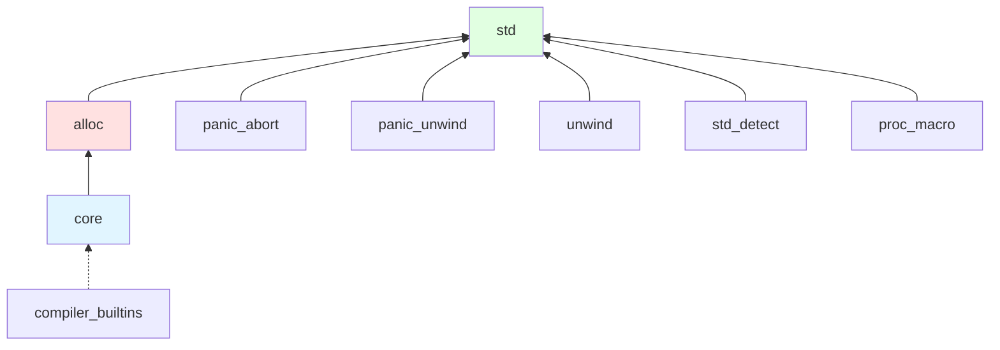

The Rust standard library is composed of multiple layers in the `library/` directory, designed to support everything from bare-metal embedded systems to full desktop operating systems.

## Library Hierarchy

The standard library follows a layered architecture:



<Info>
This layered design allows Rust to target platforms ranging from microcontrollers (core only) to full operating systems (std).
</Info>

## Core Crates

### core - The Foundation

**core** is the foundation of the Rust standard library, containing primitives that work everywhere:

<Card>
  ```toml
  [package]
  name = "core"
  version = "0.0.0"
  edition = "2024"
  description = "The Rust Core Library"
  ```
</Card>

<Tabs>
  <Tab title="Key Features">
    **core** is `#![no_std]` compatible and includes:
    
    - Primitive types (`i32`, `bool`, `char`, etc.)
    - Core traits (`Copy`, `Clone`, `Eq`, `Ord`, etc.)
    - Option and Result types
    - Iterators and iterator traits
    - Slice operations
    - String slices (`&str`)
    - Cell types (`Cell`, `RefCell`)
    - Pointers and references
    - SIMD types via portable-simd
  </Tab>
  
  <Tab title="No Dependencies">
    **core** has zero external dependencies:
    
    - No operating system
    - No heap allocation
    - No I/O
    - No threading
    - No file system
    
    This makes it suitable for:
    - Embedded systems
    - Bare-metal programming
    - Bootloaders
    - Operating system kernels
  </Tab>
  
  <Tab title="Features">
    ```toml
    [features]
    panic_immediate_abort = []
    optimize_for_size = []
    debug_refcell = []
    llvm_enzyme = []
    ```
    
    - **panic_immediate_abort**: Abort immediately on panic
    - **optimize_for_size**: Prefer smaller code size
    - **debug_refcell**: Additional RefCell debugging
    - **llvm_enzyme**: LLVM Enzyme auto-differentiation support
  </Tab>
</Tabs>

<Note>
The **core** crate is re-exported by **std**, so users typically access it through `std::` rather than `core::` directly.
</Note>

### alloc - Heap Allocation

**alloc** provides heap-allocated types without requiring a full OS:

<CardGroup cols={2}>
  <Card title="Collections" icon="box">
    - `Vec<T>`: Growable arrays
    - `String`: Owned strings
    - `BTreeMap`/`BTreeSet`: Ordered maps/sets
    - `LinkedList`: Doubly-linked lists
    - `VecDeque`: Double-ended queue
  </Card>
  
  <Card title="Smart Pointers" icon="link">
    - `Box<T>`: Heap allocation
    - `Rc<T>`: Reference counting
    - `Arc<T>`: Atomic reference counting
    - `Weak<T>`: Weak references
  </Card>
</CardGroup>

**alloc** requires:
- A global allocator
- Basic OS primitives for memory allocation

**alloc** does NOT require:
- File system
- Networking
- Threading (except for `Arc`)

<Accordion title="alloc Features">
  ```toml
  [features]
  compiler-builtins-c = []
  compiler-builtins-mem = []
  optimize_for_size = []
  ```
  
  These features are primarily used when building custom sysroots for embedded targets.
</Accordion>

### std - The Complete Standard Library

**std** is the full standard library for hosted environments:

```toml
[package]
name = "std"
version = "0.0.0"
edition = "2024"
description = "The Rust Standard Library"

[dependencies]
alloc = { path = "../alloc", public = true }
core = { path = "../core", public = true }
panic_unwind = { path = "../panic_unwind", optional = true }
panic_abort = { path = "../panic_abort" }
unwind = { path = "../unwind" }
std_detect = { path = "../std_detect", public = true }
```

<Tabs>
  <Tab title="Platform Support">
    **std** provides OS-specific functionality:
    
    - File system operations (`std::fs`)
    - Networking (`std::net`)
    - Threading (`std::thread`)
    - Process management (`std::process`)
    - Environment variables (`std::env`)
    - Time and duration (`std::time`)
    - Synchronization primitives (`std::sync`)
  </Tab>
  
  <Tab title="Platform Dependencies">
    Platform-specific dependencies:
    
    ```toml
    # Unix-like systems
    [target.'cfg(not(all(windows, target_env = "msvc")))'.dependencies]
    libc = { version = "0.2.178", public = true }
    
    # Windows
    [target.'cfg(any(windows, target_os = "cygwin"))'.dependencies]
    windows-link = { path = "../windows_link" }
    
    # WASM
    [target.'cfg(target_family = "wasm")'.dependencies]
    dlmalloc = { version = "0.2.10" }
    
    # WASI
    [target.'cfg(all(target_os = "wasi", target_env = "p2"))'.dependencies]
    wasi = { version = '0.14.4', package = 'wasi' }
    ```
  </Tab>
  
  <Tab title="Re-exports">
    **std** re-exports both **core** and **alloc**:
    
    ```rust
    // Users write:
    use std::vec::Vec;      // Actually from alloc
    use std::option::Option; // Actually from core
    use std::fs::File;       // Actually from std
    ```
    
    This provides a unified API while maintaining the layered architecture.
  </Tab>
</Tabs>

## Supporting Crates

### Platform Detection and Features

<CardGroup cols={2}>
  <Card title="std_detect" icon="microchip">
    **std_detect** provides CPU feature detection:
    
    - SIMD instruction detection
    - Runtime CPU feature detection
    - Architecture-specific features
    - Used by stdarch for portable SIMD
  </Card>
  
  <Card title="portable-simd" icon="arrows-left-right">
    **portable-simd** provides portable SIMD types:
    
    - Vector types (`Simd<T, N>`)
    - Portable across architectures
    - Compile-time and runtime dispatch
    - Integrated with core
  </Card>
</CardGroup>

### Architecture-Specific Support

**stdarch** contains architecture-specific intrinsics:

<Accordion title="Supported Architectures">
  - x86/x86_64: SSE, AVX, AVX2, AVX-512
  - ARM/AArch64: NEON, SVE
  - RISC-V: Vector extensions
  - WebAssembly: SIMD128
  - PowerPC, MIPS, and more
  
  Each architecture has intrinsics for:
  - SIMD operations
  - Atomic operations
  - Special instructions
  - Performance counters
</Accordion>

### Panic Handling

Two panic runtime options:

<Tabs>
  <Tab title="panic_unwind">
    **panic_unwind** implements unwinding panic runtime:
    
    - Stack unwinding on panic
    - Running destructors during unwind
    - Catching panics with `catch_unwind`
    - Larger binary size
    - Default for most targets
    
    ```toml
    [features]
    panic-unwind = ["dep:panic_unwind"]
    ```
  </Tab>
  
  <Tab title="panic_abort">
    **panic_abort** implements aborting panic runtime:
    
    - Immediate program termination
    - No stack unwinding
    - Smaller binary size
    - Required for some embedded targets
    - Enabled with `-C panic=abort`
    
    Always compiled with panic=abort:
    ```toml
    [profile.*.package.panic_abort]
    rustflags = ["-Cpanic=abort"]
    ```
  </Tab>
</Tabs>

**unwind** provides unwinding abstractions:
- Interfaces with system unwinding libraries
- Supports libunwind, LLVM libunwind, or system libunwind

### Low-Level Runtime Support

<AccordionGroup>
  <Accordion title="compiler_builtins">
    **compiler_builtins** provides compiler intrinsics:
    
    - Low-level operations not provided by LLVM
    - Integer division/multiplication on some platforms
    - Floating-point operations
    - Memory operations (memcpy, memset, etc.)
    
    Configured with high codegen units:
    ```toml
    [profile.release.package.compiler_builtins]
    codegen-units = 10000  # One intrinsic per object file
    ```
  </Accordion>
  
  <Accordion title="profiler_builtins">
    **profiler_builtins** provides profiling support:
    
    - Coverage instrumentation
    - Profile-guided optimization (PGO)
    - Integration with LLVM profiling
  </Accordion>
  
  <Accordion title="backtrace">
    Backtrace support integrated into **std**:
    
    ```toml
    [features]
    backtrace = [
      'addr2line/rustc-dep-of-std',
      'object/rustc-dep-of-std',
      'miniz_oxide/rustc-dep-of-std',
    ]
    ```
    
    Dependencies for symbolication:
    - `addr2line`: DWARF debug info parsing
    - `object`: Object file parsing
    - `miniz_oxide`: Compression
    - `rustc-demangle`: Symbol demangling
  </Accordion>
  
  <Accordion title="rtstartup">
    **rtstartup** provides runtime startup code for some platforms.
  </Accordion>
</AccordionGroup>

### Procedural Macros

**proc_macro** is the procedural macro API:

<Info>
Unlike other standard library crates, **proc_macro** is special: it runs at compile time in the compiler process, not in the compiled program.
</Info>

```rust
// Proc macros run at compile time
#[derive(Debug)]  // Uses proc_macro infrastructure
struct MyStruct;
```

Key capabilities:
- Custom derive macros
- Attribute macros
- Function-like macros
- Token stream manipulation

### Testing Infrastructure

**test** provides the test harness:

```rust
#[test]
fn my_test() {
    assert_eq!(2 + 2, 4);
}
```

<Tabs>
  <Tab title="Test Features">
    - Test discovery and execution
    - Benchmark support
    - Test filtering
    - Parallel test execution
    - Output capture
    - Custom test frameworks
  </Tab>
  
  <Tab title="Internal Tests">
    **coretests** and **alloctests** test core and alloc:
    
    ```toml
    [workspace]
    members = [
      "std",
      "core",
      "alloc",
      "coretests",  # Tests for core
      "alloctests", # Tests for alloc
    ]
    ```
  </Tab>
</Tabs>

## Workspace Organization

The library workspace is managed by `library/Cargo.toml`:

```toml
[workspace]
resolver = "1"
members = [
  "std",
  "sysroot",
  "coretests",
  "alloctests",
]

exclude = [
  "stdarch",        # Has its own workspace
  "windows_link"    # Platform-specific
]
```

### Rustc Standard Library Workspace Crates

These crates enable the standard library to be used with older rustc versions:

<CardGroup cols={3}>
  <Card title="rustc-std-workspace-core" icon="gear">
    Shim for **core** crate
  </Card>
  <Card title="rustc-std-workspace-alloc" icon="gear">
    Shim for **alloc** crate
  </Card>
  <Card title="rustc-std-workspace-std" icon="gear">
    Shim for **std** crate
  </Card>
</CardGroup>

From `library/Cargo.toml`:
```toml
[patch.crates-io]
rustc-std-workspace-core = { path = 'rustc-std-workspace-core' }
rustc-std-workspace-alloc = { path = 'rustc-std-workspace-alloc' }
rustc-std-workspace-std = { path = 'rustc-std-workspace-std' }
```

### Sysroot Crate

**sysroot** is a special crate that depends on all standard library crates:

<Note>
The sysroot crate ensures all standard library components are built and available in the compiler's sysroot.
</Note>

## Platform-Specific Crates

### Windows Support

**windows_link** handles Windows-specific linking:

```toml
[target.'cfg(any(windows, target_os = "cygwin"))'.dependencies.windows-link]
path = "../windows_link"
```

Features:
```toml
[features]
windows_raw_dylib = ["windows-link/windows_raw_dylib"]
```

Enables raw-dylib for Windows imports (smaller binaries, faster loading).

### Platform-Specific Dependencies

<Tabs>
  <Tab title="Unix-like">
    ```toml
    [target.'cfg(not(all(windows, target_env = "msvc")))'.dependencies]
    libc = { version = "0.2.178", public = true }
    ```
    
    **libc** provides C library bindings for:
    - POSIX APIs
    - System calls
    - C standard library functions
  </Tab>
  
  <Tab title="WASM/Embedded">
    ```toml
    # WASM without OS
    [target.'cfg(target_family = "wasm")'.dependencies]
    dlmalloc = { version = "0.2.10" }
    
    # Fortanix SGX
    [target.x86_64-fortanix-unknown-sgx.dependencies]
    fortanix-sgx-abi = { version = "0.6.1", public = true }
    
    # Hermit OS
    [target.'cfg(target_os = "hermit")'.dependencies]
    hermit-abi = { version = "0.5.0", public = true }
    ```
  </Tab>
  
  <Tab title="WASI">
    ```toml
    # WASI Preview 1
    [target.'cfg(all(target_os = "wasi", target_env = "p1"))'.dependencies]
    wasi = { version = "0.11.0" }
    
    # WASI Preview 2 and 3
    [target.'cfg(all(target_os = "wasi", target_env = "p2"))'.dependencies]
    wasip2 = { version = '0.14.4', package = 'wasi' }
    ```
    
    Supports multiple WASI versions for WebAssembly System Interface.
  </Tab>
  
  <Tab title="Exotic Targets">
    ```toml
    # UEFI
    [target.'cfg(target_os = "uefi")'.dependencies]
    r-efi = { version = "5.2.0" }
    r-efi-alloc = { version = "2.0.0" }
    
    # VexOS (VEX robotics)
    [target.'cfg(target_os = "vexos")'.dependencies]
    vex-sdk = { version = "0.27.0" }
    
    # Motor OS
    [target.'cfg(target_os = "motor")'.dependencies]
    moto-rt = { version = "0.16", public = true }
    ```
  </Tab>
</Tabs>

## Build Profiles and Optimization

Special build profiles for the standard library:

<AccordionGroup>
  <Accordion title="Distribution Profile">
    The `dist` profile is used for prebuilt standard library artifacts:
    
    ```toml
    [profile.dist]
    inherits = "release"
    codegen-units = 1
    debug = 1  # "limited" debug info
    rustflags = [
      "-Cembed-bitcode=yes",           # For LTO
      "-Zunstable-options",
      "-Cforce-frame-pointers=non-leaf", # Better profiling
    ]
    ```
  </Accordion>
  
  <Accordion title="Dependency Optimization">
    Backtrace dependencies are optimized for size and speed:
    
    ```toml
    [profile.release.package]
    addr2line.opt-level = "s"      # Optimize for size
    addr2line.debug = 0
    gimli.opt-level = "s"
    miniz_oxide.opt-level = "s"
    rustc-demangle.opt-level = "s"
    object.debug = 0
    ```
  </Accordion>
</AccordionGroup>

## Standard Library Features

The standard library exposes several feature flags:

```toml
[features]
backtrace = [...]              # Enable backtrace symbolication
backtrace-trace-only = []      # Backtrace without symbolization
panic-unwind = [...]           # Unwinding panic runtime
compiler-builtins-c = [...]    # C implementation of builtins
compiler-builtins-mem = [...]  # Memory operation builtins
optimize_for_size = [...]      # Optimize for binary size
debug_refcell = [...]          # Additional RefCell debugging
llvm_enzyme = [...]            # LLVM Enzyme support
windows_raw_dylib = [...]      # Raw dylib imports on Windows
```

## Target Support Tiers

The standard library supports multiple tiers of targets:

<Tabs>
  <Tab title="Tier 1">
    Full standard library support with guaranteed CI:
    - x86_64-unknown-linux-gnu
    - x86_64-pc-windows-msvc
    - x86_64-apple-darwin
    - aarch64-apple-darwin
  </Tab>
  
  <Tab title="Tier 2">
    Standard library available, may not have CI:
    - Many Linux, Windows, macOS variants
    - Various ARM targets
    - WebAssembly targets
    - WASI targets
  </Tab>
  
  <Tab title="Tier 3">
    May only support **core** or **alloc**:
    - Embedded targets
    - Exotic operating systems
    - Experimental platforms
  </Tab>
</Tabs>

## Memory Allocator Integration

Different targets use different allocators:

<CardGroup cols={2}>
  <Card title="System Allocator" icon="server">
    Desktop/server platforms:
    - Linux: glibc malloc
    - Windows: HeapAlloc
    - macOS: malloc/free
  </Card>
  
  <Card title="dlmalloc" icon="microchip">
    Embedded/WASM platforms:
    - Pure Rust allocator
    - No OS dependencies
    - Suitable for `#![no_std]` + alloc
  </Card>
</CardGroup>

## Design Principles

<CardGroup cols={2}>
  <Card title="Zero-Cost Abstractions" icon="gauge-high">
    Standard library features compile to efficient code with no runtime overhead
  </Card>
  
  <Card title="Layered Architecture" icon="layer-group">
    core → alloc → std allows targeting diverse platforms
  </Card>
  
  <Card title="Platform Independence" icon="globe">
    Core abstractions work consistently across all supported platforms
  </Card>
  
  <Card title="Safety First" icon="shield">
    Safe abstractions over unsafe platform APIs
  </Card>
</CardGroup>

## Further Reading

<CardGroup cols={2}>
  <Card title="Compiler Architecture" icon="microchip" href="/architecture/compiler">
    How the compiler uses and compiles the standard library
  </Card>
  <Card title="Bootstrap System" icon="arrows-rotate" href="/architecture/bootstrap">
    Building the standard library through multi-stage bootstrap
  </Card>
  <Card title="The Rustonomicon" icon="book">
    Advanced topics: https://doc.rust-lang.org/nomicon/
  </Card>
  <Card title="std Documentation" icon="book-open">
    API documentation: https://doc.rust-lang.org/std/
  </Card>
</CardGroup>
