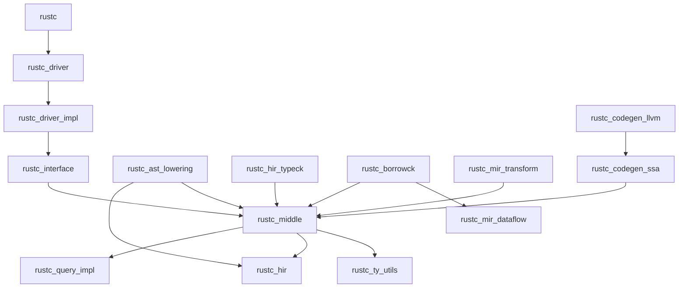

The Rust compiler consists of 75 specialized crates that work together to compile Rust code. Each crate has a specific responsibility in the compilation pipeline.

## Core Infrastructure Crates

<AccordionGroup>
  <Accordion title="rustc - Main Compiler Driver">
    The main compiler binary that orchestrates the entire compilation process. Acts as the entry point for the rustc executable.
    
    **Dependencies:** `rustc_driver`, `rustc_driver_impl`, `rustc_codegen_ssa`, `rustc_public`, `rustc_public_bridge`
  </Accordion>

  <Accordion title="rustc_driver - Compiler Driver (Re-export)">
    An intentionally minimal re-export crate of `rustc_driver_impl` that allows parallel compilation of driver implementation code.
  </Accordion>

  <Accordion title="rustc_driver_impl - Compiler Driver Implementation">
    Contains the actual implementation of the compiler driver, including command-line argument parsing and compilation orchestration.
  </Accordion>

  <Accordion title="rustc_interface - Compiler Interface">
    Provides the main interface for driving the compiler, including the query system initialization and compilation passes.
  </Accordion>

  <Accordion title="rustc_session - Compilation Session">
    Manages the compilation session, including configuration, diagnostics state, and global compiler settings.
  </Accordion>
</AccordionGroup>

## Data Structures and Utilities

<AccordionGroup>
  <Accordion title="rustc_data_structures - Core Data Structures">
    Various data structures used by the Rust compiler. This crate is designed to be generic and not specific to rustc for easier unit testing.
    
    Includes specialized collections, synchronization primitives, and compiler-specific data structures.
  </Accordion>

  <Accordion title="rustc_arena - Arena Allocator">
    A fast but limited type of allocator. Arenas destroy all objects within at once when the arena itself is destroyed. They don't support deallocation of individual objects while the arena is alive.
    
    Used extensively for allocating compiler data structures that share the same lifetime.
  </Accordion>

  <Accordion title="rustc_index - Index Types">
    Provides newtype wrappers for indices, including `IndexVec` for vectors indexed by custom types.
  </Accordion>

  <Accordion title="rustc_index_macros - Index Macros">
    Procedural macros for generating index types and related functionality.
  </Accordion>

  <Accordion title="rustc_hashes - Hash Functions">
    Specialized hash functions optimized for compiler use cases.
  </Accordion>

  <Accordion title="rustc_serialize - Serialization">
    Serialization and deserialization infrastructure for compiler data structures.
  </Accordion>
</AccordionGroup>

## Abstract Syntax Tree (AST)

<AccordionGroup>
  <Accordion title="rustc_ast - Abstract Syntax Tree">
    The Rust Abstract Syntax Tree (AST) definition. This is the initial representation of Rust source code after parsing.
    
    **Note:** This API is completely unstable and subject to change.
  </Accordion>

  <Accordion title="rustc_ast_ir - AST Intermediate Representation">
    Shared intermediate representation types used by both AST and HIR.
  </Accordion>

  <Accordion title="rustc_ast_lowering - AST to HIR Lowering">
    Converts the Abstract Syntax Tree (AST) into High-Level Intermediate Representation (HIR).
    
    **Key dependencies:** `rustc_ast`, `rustc_hir`, `rustc_middle`, `rustc_span`
  </Accordion>

  <Accordion title="rustc_ast_passes - AST Analysis Passes">
    Various analysis passes that run on the AST, including validation and attribute checking.
  </Accordion>

  <Accordion title="rustc_ast_pretty - AST Pretty Printing">
    Pretty printing for AST nodes, useful for debugging and diagnostics.
  </Accordion>
</AccordionGroup>

## High-Level Intermediate Representation (HIR)

<AccordionGroup>
  <Accordion title="rustc_hir - High-Level IR">
    HIR datatypes. HIR is a desugared and more compiler-friendly representation of Rust code.
    
    See the [rustc dev guide](https://rustc-dev-guide.rust-lang.org/hir.html) for more info.
  </Accordion>

  <Accordion title="rustc_hir_id - HIR Identifiers">
    Identifier types for HIR nodes.
  </Accordion>

  <Accordion title="rustc_hir_analysis - HIR Type Checking">
    Type checking and analysis on HIR, including trait resolution setup and coherence checking.
  </Accordion>

  <Accordion title="rustc_hir_typeck - HIR Type Checking">
    Type checking for HIR expressions, patterns, and function bodies.
  </Accordion>

  <Accordion title="rustc_hir_pretty - HIR Pretty Printing">
    Pretty printing for HIR nodes.
  </Accordion>
</AccordionGroup>

## Mid-Level Intermediate Representation (MIR)

<AccordionGroup>
  <Accordion title="rustc_mir_build - MIR Construction">
    Builds MIR (Mid-level Intermediate Representation) from THIR (Typed High-Level IR).
  </Accordion>

  <Accordion title="rustc_mir_dataflow - MIR Dataflow Analysis">
    Dataflow analysis framework for MIR, used by borrowck and other analyses.
  </Accordion>

  <Accordion title="rustc_mir_transform - MIR Optimization Passes">
    Optimization and transformation passes on MIR, including inlining, dead code elimination, and constant propagation.
  </Accordion>
</AccordionGroup>

## Type System and Inference

<AccordionGroup>
  <Accordion title="rustc_middle - Middle Layer">
    The "main crate" of the Rust compiler. Contains common type definitions used by other crates in the rustc family.
    
    Includes:
    - Type system definitions (`ty` module)
    - MIR definitions
    - Query system declarations
    - Trait system types
    
    **Key dependencies:** Extensive - nearly every compiler crate
  </Accordion>

  <Accordion title="rustc_type_ir - Type System IR">
    Core type system intermediate representation, shared across different compiler contexts.
  </Accordion>

  <Accordion title="rustc_type_ir_macros - Type IR Macros">
    Procedural macros for type system IR.
  </Accordion>

  <Accordion title="rustc_infer - Type Inference">
    Type inference engine for Rust. Handles low-level equality and subtyping operations.
    
    The type check pass is found in `rustc_hir_analysis`.
  </Accordion>

  <Accordion title="rustc_trait_selection - Trait Resolution">
    Trait resolution implementation, including trait selection, projection, and method resolution.
    
    For more information, see the [rustc-dev-guide](https://rustc-dev-guide.rust-lang.org).
  </Accordion>

  <Accordion title="rustc_traits - Trait Queries">
    Query implementations for trait-related operations.
  </Accordion>

  <Accordion title="rustc_next_trait_solver - Next-Gen Trait Solver">
    Next-generation trait solver implementation (experimental).
  </Accordion>

  <Accordion title="rustc_ty_utils - Type Utilities">
    Various type-related utility functions and query implementations.
  </Accordion>
</AccordionGroup>

## Borrow Checking

<AccordionGroup>
  <Accordion title="rustc_borrowck - Borrow Checker">
    MIR type checking and borrow checking implementation. Ensures memory safety by validating lifetimes and borrows.
    
    **Key dependencies:** `rustc_middle`, `rustc_mir_dataflow`, `rustc_infer`, `polonius-engine`
  </Accordion>
</AccordionGroup>

## Code Generation

<AccordionGroup>
  <Accordion title="rustc_codegen_ssa - Codegen Abstraction">
    Shared code generation abstractions used by all codegen backends. Provides a common interface for code generation.
  </Accordion>

  <Accordion title="rustc_codegen_llvm - LLVM Backend">
    LLVM-based code generation backend for rustc. The primary and most mature backend.
    
    **Key dependencies:** `rustc_codegen_ssa`, `rustc_llvm`, `rustc_middle`, `rustc_target`
    
    **Features:** `llvm_enzyme`, `llvm_offload`
  </Accordion>

  <Accordion title="rustc_codegen_gcc - GCC Backend">
    GCC-based code generation backend (experimental, excluded from main workspace).
  </Accordion>

  <Accordion title="rustc_codegen_cranelift - Cranelift Backend">
    Cranelift-based code generation backend for faster debug builds (experimental, excluded from main workspace).
  </Accordion>

  <Accordion title="rustc_llvm - LLVM Bindings">
    Rust bindings to LLVM for code generation.
  </Accordion>

  <Accordion title="rustc_monomorphize - Monomorphization">
    Monomorphization of generic functions - creates concrete versions of generic code for each type.
  </Accordion>

  <Accordion title="rustc_symbol_mangling - Symbol Mangling">
    Symbol name mangling for generated code to avoid name conflicts.
  </Accordion>
</AccordionGroup>

## Lexing and Parsing

<AccordionGroup>
  <Accordion title="rustc_lexer - Lexical Analysis">
    Breaks source code into tokens. Low-level lexer with minimal dependencies.
  </Accordion>

  <Accordion title="rustc_parse - Parser">
    Parses Rust source code into an Abstract Syntax Tree (AST).
  </Accordion>

  <Accordion title="rustc_parse_format - Format String Parser">
    Parser for format strings used in `format!`, `println!`, etc.
  </Accordion>
</AccordionGroup>

## Name Resolution

<AccordionGroup>
  <Accordion title="rustc_resolve - Name Resolution">
    Responsible for name resolution that doesn't require the type checker.
    
    - Builds module structure
    - Resolves paths in macros, imports, expressions, types, patterns
    - Resolves label and lifetime names
  </Accordion>

  <Accordion title="rustc_privacy - Privacy Checking">
    Checks privacy rules and computes effective visibilities.
  </Accordion>
</AccordionGroup>

## Macro Expansion

<AccordionGroup>
  <Accordion title="rustc_expand - Macro Expansion">
    Macro expansion engine, including declarative macros and procedural macro support.
  </Accordion>

  <Accordion title="rustc_builtin_macros - Built-in Macros">
    Implementation of built-in macros like `println!`, `derive`, `cfg!`, etc.
  </Accordion>

  <Accordion title="rustc_macros - Compiler Macros">
    Procedural macros used internally by the compiler, including query system macros.
  </Accordion>

  <Accordion title="rustc_proc_macro - Procedural Macro Support">
    Runtime support for procedural macros.
  </Accordion>
</AccordionGroup>

## Analysis Passes

<AccordionGroup>
  <Accordion title="rustc_passes - Compiler Passes">
    Various analysis and validation passes, including:
    - Dead code detection
    - Reachability analysis  
    - Stability checking
    - Language item collection
    - Entry point detection
    
    **Note:** This API is completely unstable and subject to change.
  </Accordion>

  <Accordion title="rustc_const_eval - Constant Evaluation">
    Compile-time evaluation of constant expressions and validation of const contexts.
  </Accordion>

  <Accordion title="rustc_pattern_analysis - Pattern Analysis">
    Exhaustiveness checking and usefulness analysis for pattern matching.
  </Accordion>

  <Accordion title="rustc_transmute - Transmute Checking">
    Safety checking for `transmute` operations.
  </Accordion>
</AccordionGroup>

## Incremental Compilation and Queries

<AccordionGroup>
  <Accordion title="rustc_query_impl - Query System Implementation">
    Implementation of the demand-driven query system, including caching and dependency tracking.
    
    Supports serializing the dependency graph for incremental compilation.
  </Accordion>

  <Accordion title="rustc_incremental - Incremental Compilation">
    Incremental compilation support, including dependency graph management.
  </Accordion>
</AccordionGroup>

## Metadata and Linking

<AccordionGroup>
  <Accordion title="rustc_metadata - Crate Metadata">
    Encoding and decoding of crate metadata for separate compilation.
  </Accordion>

  <Accordion title="rustc_target - Target Specification">
    Target platform specifications and code generation parameters.
    
    Contains information about different compilation targets, including platform ABIs, calling conventions, and linker settings.
  </Accordion>

  <Accordion title="rustc_abi - ABI Definitions">
    Application Binary Interface (ABI) definitions for different platforms and types.
  </Accordion>
</AccordionGroup>

## Diagnostics and Error Reporting

<AccordionGroup>
  <Accordion title="rustc_errors - Error Diagnostics">
    Diagnostic creation and emission infrastructure. Handles all compiler warnings and errors.
  </Accordion>

  <Accordion title="rustc_error_codes - Error Code Definitions">
    Definitions of all compiler error codes (E0001, E0002, etc.).
  </Accordion>

  <Accordion title="rustc_error_messages - Error Messages">
    Internationalization and message formatting for error diagnostics.
  </Accordion>
</AccordionGroup>

## Source Code Management

<AccordionGroup>
  <Accordion title="rustc_span - Source Positions">
    Source positions and related helper functions.
    
    Important concepts:
    - Spans (represented by `SpanData`)
    - Source file management
    - Macro expansion tracking
  </Accordion>

  <Accordion title="rustc_feature - Feature Gates">
    Feature gate definitions and checking for unstable features.
  </Accordion>

  <Accordion title="rustc_attr_parsing - Attribute Parsing">
    Parsing and validation of Rust attributes.
  </Accordion>
</AccordionGroup>

## Linting

<AccordionGroup>
  <Accordion title="rustc_lint - Lint Infrastructure">
    Lint checking infrastructure and built-in lints.
  </Accordion>

  <Accordion title="rustc_lint_defs - Lint Definitions">
    Definitions of all built-in lints.
  </Accordion>
</AccordionGroup>

## Specialized Utilities

<AccordionGroup>
  <Accordion title="rustc_fs_util - Filesystem Utilities">
    File system utilities for the compiler.
  </Accordion>

  <Accordion title="rustc_graphviz - Graphviz Output">
    Utilities for generating Graphviz visualizations of compiler data structures.
  </Accordion>

  <Accordion title="rustc_log - Logging">
    Logging infrastructure for the compiler.
  </Accordion>

  <Accordion title="rustc_sanitizers - Sanitizer Support">
    Support for AddressSanitizer, ThreadSanitizer, and other sanitizers.
  </Accordion>

  <Accordion title="rustc_thread_pool - Thread Pool">
    Thread pool for parallel compilation.
  </Accordion>

  <Accordion title="rustc_windows_rc - Windows Resources">
    Windows resource compilation support.
  </Accordion>

  <Accordion title="rustc_baked_icu_data - ICU Data">
    Internationalization data for the compiler.
  </Accordion>
</AccordionGroup>

## Public API

<AccordionGroup>
  <Accordion title="rustc_public - Public Compiler API">
    Public API for compiler consumers.
  </Accordion>

  <Accordion title="rustc_public_bridge - Public API Bridge">
    Bridge between the internal compiler API and the public stable MIR API.
    
    Intended to be used by stable MIR consumers that are not in-tree.
  </Accordion>
</AccordionGroup>

## Crate Dependency Graph

<Note>
The Rust compiler has 75 crates working together. This modular architecture allows for:
- Parallel compilation
- Clear separation of concerns  
- Easier maintenance and testing
- Flexible backend support (LLVM, GCC, Cranelift)
</Note>

## Related Documentation

<CardGroup cols={2}>
  <Card title="Compiler Passes" icon="layer-group" href="/reference/passes">
    Learn about the compilation pipeline and analysis passes
  </Card>
  <Card title="Query System" icon="database" href="/reference/queries">
    Understand the demand-driven query system
  </Card>
</CardGroup>