The Rust compiler processes code through a series of transformation passes, converting source code into executable binaries. Each pass performs specific analyses or transformations.

## Compilation Pipeline Overview

```mermaid
graph LR
    A[Source Code] --> B[Lexing]
    B --> C[Parsing]
    C --> D[AST]
    D --> E[Macro Expansion]
    E --> F[Name Resolution]
    F --> G[AST Lowering]
    G --> H[HIR]
    H --> I[Type Checking]
    I --> J[MIR Building]
    J --> K[MIR Optimization]
    K --> L[Monomorphization]
    L --> M[Code Generation]
    M --> N[LLVM IR]
    N --> O[Binary]
```



## Early Passes

### Lexing and Parsing

<AccordionGroup>
  <Accordion title="parse - Source Code Parsing">
    **Location:** `rustc_interface::passes::parse`
    
    The first major pass that converts source code into an Abstract Syntax Tree (AST).
    
    **Process:**
    1. Creates a parser from file or string input
    2. Tokenizes the source code (lexing)
    3. Parses tokens into AST nodes
    4. Injects command-line attributes into the crate
    
    **Input:** Raw source code (`Input::File` or `Input::Str`)
    
    **Output:** `ast::Crate`
    
    **Error Handling:** Parse errors are emitted immediately and cause compilation to abort.
  </Accordion>

  <Accordion title="pre_expansion_lint - Early Lint Checks">
    **Location:** `rustc_interface::passes::pre_expansion_lint`
    
    Runs lints on the AST before macro expansion. These lints check for issues that should be caught early.
    
    **Timing:** Before macro expansion
    
    **Input:** AST nodes, attributes, features
    
    **Lints Checked:** Built-in pre-expansion lints from `rustc_lint::BuiltinCombinedPreExpansionLintPass`
  </Accordion>
</AccordionGroup>

### Macro Processing

<AccordionGroup>
  <Accordion title="configure_and_expand - Macro Expansion">
    **Location:** `rustc_interface::passes::configure_and_expand`
    
    Runs the "early phases" of compilation: cfg processing, syntax expansion, and name resolution.
    
    **Major Steps:**
    
    1. **Crate Injection** - Injects standard library imports
    2. **Macro Expansion** - Expands all macros recursively
    3. **Test Harness** - Injects test harness if `--test` is specified
    4. **AST Validation** - Validates the expanded AST
    5. **Proc Macro Harness** - Injects procedural macro runtime
    6. **Name Resolution** - Resolves all names and paths
    
    **Configuration:**
    - Respects recursion limits
    - Handles `cfg` attributes
    - Processes feature gates
    
    **Input:** Unexpanded `ast::Crate`, `Resolver`
    
    **Output:** Fully expanded `ast::Crate` with all macros expanded
  </Accordion>

  <Accordion title="expand_crate - Macro Expansion Core">
    **Timing:** Within `configure_and_expand`
    
    The core macro expansion pass that:
    - Expands declarative macros (`macro_rules!`)
    - Calls procedural macros
    - Expands built-in macros like `println!`, `derive`, etc.
    - Handles macro imports and exports
    
    **Recursion Limit:** Configurable via `#![recursion_limit]` attribute
  </Accordion>
</AccordionGroup>

## Analysis Passes

### HIR Construction and Analysis

<AccordionGroup>
  <Accordion title="resolver_for_lowering_raw - Resolution for Lowering">
    **Location:** `rustc_interface::passes::resolver_for_lowering_raw`
    
    **Query:** `resolver_for_lowering_raw`
    
    Prepares resolution data needed for AST lowering to HIR.
    
    **Output:** 
    - `ResolverAstLowering` - Resolution tables for lowering
    - Expanded `ast::Crate`
    - `ResolverGlobalCtxt` - Global resolution context
  </Accordion>

  <Accordion title="hir_crate - HIR Construction">
    **Query:** `hir_crate`
    
    Lowers the expanded AST into High-Level Intermediate Representation (HIR).
    
    **Performed by:** `rustc_ast_lowering`
    
    **Transformations:**
    - Desugars complex syntax into simpler forms
    - Converts `for` loops to `loop` + `match`
    - Expands question mark operator (`?`)
    - Normalizes closure syntax
    
    **Output:** `Crate<'tcx>` - The HIR crate
  </Accordion>

  <Accordion title="early_lint_checks - Early HIR Lints">
    **Location:** `rustc_interface::passes::early_lint_checks`
    
    **Query:** `early_lint_checks`
    
    Runs lints that operate on the fully expanded AST and early HIR.
    
    **Timing:** After expansion, before type checking
  </Accordion>
</AccordionGroup>

### Type Checking and Inference

<AccordionGroup>
  <Accordion title="Type Collection">
    **Queries:** `type_of`, `generics_of`, `predicates_of`
    
    Collects type signatures from all items in the crate.
    
    **Process:**
    1. Collect types from item signatures
    2. Build generic parameter lists
    3. Collect trait bounds and where clauses
    4. Validate type well-formedness
  </Accordion>

  <Accordion title="Type Checking (Typeck)">
    **Primary Crate:** `rustc_hir_typeck`
    
    **Queries:** Per-function type checking queries
    
    Performs type inference and checking for function bodies.
    
    **Major Components:**
    - Expression type checking
    - Pattern type checking  
    - Method resolution
    - Operator overload resolution
    - Type coercion
    - Closure signature inference
    
    **Algorithm:** Uses unification-based type inference with constraints
  </Accordion>

  <Accordion title="Trait Resolution">
    **Primary Crate:** `rustc_trait_selection`
    
    Resolves trait implementations and validates trait bounds.
    
    **Operations:**
    - Trait selection (finding applicable impls)
    - Projection (resolving associated types)
    - Method candidate resolution
    - Impl overlap checking
    - Coherence checking
  </Accordion>
</AccordionGroup>

### MIR Passes

<AccordionGroup>
  <Accordion title="mir_built - MIR Construction">
    **Query:** `mir_built`
    
    **Primary Crate:** `rustc_mir_build`
    
    Builds MIR (Mid-level Intermediate Representation) from THIR (Typed HIR).
    
    **Steps:**
    1. Lower HIR to THIR (adds type information)
    2. Build MIR control flow graph
    3. Generate MIR for match expressions
    4. Insert drop glue
    
    **Output:** `mir::Body<'tcx>` - Unoptimized MIR
  </Accordion>

  <Accordion title="Borrow Checking">
    **Primary Crate:** `rustc_borrowck`
    
    **Queries:** `mir_borrowck`
    
    Validates memory safety through borrow checking.
    
    **Checks:**
    - Validates borrows don't outlive referenced data
    - Ensures no simultaneous mutable and immutable borrows
    - Prevents use-after-move
    - Validates initialization before use
    
    **Algorithm:** Dataflow analysis on MIR using polonius or NLL (Non-Lexical Lifetimes)
  </Accordion>

  <Accordion title="MIR Optimization Passes">
    **Primary Crate:** `rustc_mir_transform`
    
    Performs optimization passes on MIR.
    
    **Major Optimizations:**
    
    - **Inlining** - Inline small functions
    - **Constant Propagation** - Evaluate constants at compile time
    - **Dead Code Elimination** - Remove unreachable code
    - **Copy Propagation** - Eliminate unnecessary copies
    - **Destination Propagation** - Optimize memory destinations
    - **Simplify CFG** - Simplify control flow graph
    - **InstCombine** - Combine instructions
    
    **Levels:** Different optimization levels run different passes
  </Accordion>
</AccordionGroup>

### Additional Analysis Passes

<AccordionGroup>
  <Accordion title="Reachability Analysis">
    **Module:** `rustc_passes::reachable`
    
    Determines which items are reachable from entry points.
    
    **Used For:**
    - Dead code detection
    - Determining what to include in metadata
    - Link-time optimization decisions
  </Accordion>

  <Accordion title="Dead Code Detection">
    **Module:** `rustc_passes::dead`
    
    **Query:** Provided through `rustc_passes::provide`
    
    Detects unused code that can be removed or warned about.
    
    **Checks:**
    - Unused functions
    - Unused imports
    - Unused variables
    - Unused struct fields (private only)
  </Accordion>

  <Accordion title="Privacy Checking">
    **Primary Crate:** `rustc_privacy`
    
    Validates privacy rules (pub/private).
    
    **Checks:**
    - Private types in public signatures
    - Access to private items
    - Computes effective visibilities
  </Accordion>

  <Accordion title="Stability Checking">
    **Module:** `rustc_passes::stability`
    
    Validates use of stable/unstable features.
    
    **Checks:**
    - Unstable feature gates
    - Deprecated item usage
    - Stability attribute consistency
  </Accordion>

  <Accordion title="Entry Point Detection">
    **Module:** `rustc_passes::entry`
    
    Finds the entry point for the program (`main` function or custom entry point).
    
    **Validates:**
    - Entry point signature
    - Only one entry point exists
    - Entry point visibility
  </Accordion>
</AccordionGroup>

## Code Generation Passes

<AccordionGroup>
  <Accordion title="Monomorphization">
    **Primary Crate:** `rustc_monomorphize`
    
    Creates concrete versions of generic functions for each type they're used with.
    
    **Process:**
    1. Collect all generic items used
    2. Generate concrete versions with type parameters substituted
    3. Partition into codegen units
    4. Handle dynamic dispatch (trait objects)
    
    **Output:** `MonoItem`s - Concrete items ready for codegen
  </Accordion>

  <Accordion title="Codegen Unit Partitioning">
    **Query:** `collect_and_partition_mono_items`
    
    Divides monomorphized items into compilation units for parallel codegen.
    
    **Strategies:**
    - Per-module partitioning (faster compilation)
    - Single unit (better optimization, slower compilation)
  </Accordion>

  <Accordion title="LLVM Code Generation">
    **Primary Crate:** `rustc_codegen_llvm`
    
    Generates LLVM IR from MIR.
    
    **Steps:**
    1. Convert MIR to LLVM IR
    2. Apply LLVM optimizations
    3. Generate object files
    
    **Parallel:** Each codegen unit is compiled in parallel
  </Accordion>

  <Accordion title="Linking">
    **Final Phase:** Links object files into final binary
    
    **Process:**
    1. Collect all object files
    2. Link with runtime libraries
    3. Apply LTO (Link-Time Optimization) if enabled
    4. Produce final executable/library
  </Accordion>
</AccordionGroup>

## Pass Organization in Code

### rustc_passes Crate

The `rustc_passes` crate (`compiler/rustc_passes/`) contains various analysis passes:

```rust
// From rustc_passes/src/lib.rs
pub mod abi_test;          // ABI testing
mod check_attr;             // Attribute validation  
mod check_export;           // Export checking
pub mod dead;               // Dead code detection
mod debugger_visualizer;    // Debugger integration
mod diagnostic_items;       // Diagnostic item collection
pub mod entry;              // Entry point detection
pub mod hir_id_validator;   // HIR ID validation
pub mod input_stats;        // Input statistics
mod lang_items;             // Language item collection
pub mod layout_test;        // Layout testing
mod lib_features;           // Library feature collection
mod reachable;              // Reachability analysis
pub mod stability;          // Stability checking
mod upvars;                 // Upvar analysis
mod weak_lang_items;        // Weak language items
```

### Analysis Pass

The main `analysis` query coordinates type checking and other analyses:

**Location:** `rustc_interface::passes::analysis`

**Query:** `analysis`

**Runs:**
- Parallel type checking of all items
- Privacy checking
- Liveness analysis
- Intrinsic checking
- Variance inference
- Other whole-crate analyses

## Pass Timing and Profiling

All major passes are instrumented with timing information:

```rust
sess.time("parse_crate", || { /* parsing */ });
sess.time("macro_expand_crate", || { /* expansion */ });
sess.time("AST_validation", || { /* validation */ });
```

Use `rustc -Z time-passes` to see timing information for each pass.

## Related Documentation

<CardGroup cols={2}>
  <Card title="Query System" icon="database" href="/reference/queries">
    Learn how passes are implemented as queries
  </Card>
  <Card title="Compiler Crates" icon="cubes" href="/reference/compiler-crates">
    See which crates implement which passes
  </Card>
</CardGroup>

<Note>
Many passes are implemented as **queries** in the demand-driven query system. See the [Query System](/reference/queries) documentation for details.
</Note>