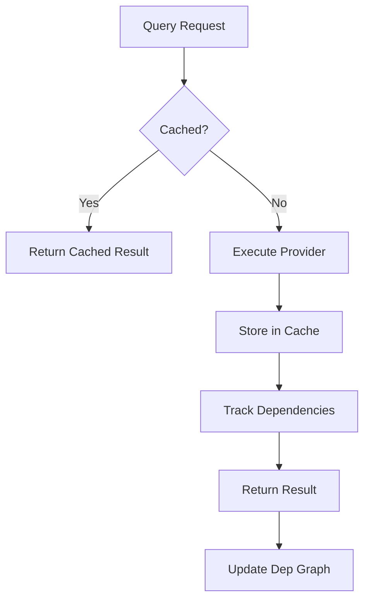
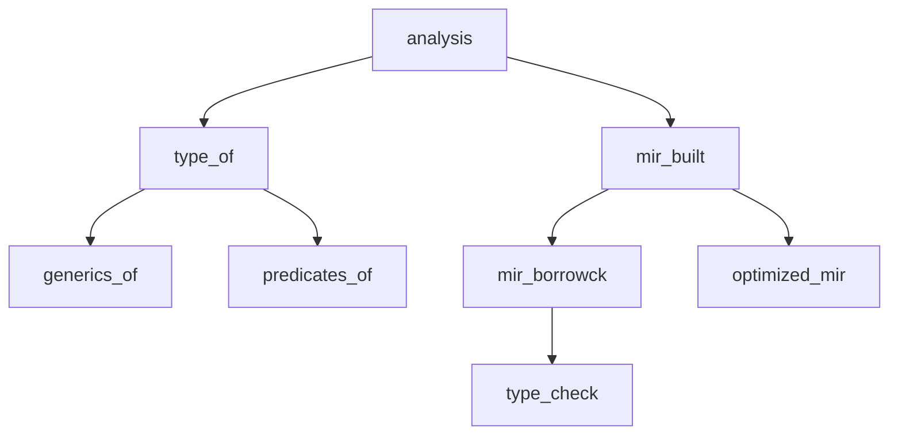

The Rust compiler uses a demand-driven query system where compilation work is organized as queries. Each query is a memoized function from a key to a value, with automatic caching and dependency tracking.

## Overview

The query system is the heart of the Rust compiler's architecture:

- **318+ queries** defined in `rustc_middle::queries`
- **Demand-driven execution** - queries only run when their results are needed
- **Automatic memoization** - results are cached for reuse
- **Dependency tracking** - changes trigger recomputation of affected queries
- **Incremental compilation** - queries enable fine-grained incremental builds

## Architecture



### Core Components

<CardGroup cols={2}>
  <Card title="rustc_middle::queries" icon="file-code">
    Query definitions with key/value types and modifiers (318+ queries)
  </Card>
  <Card title="rustc_query_impl" icon="gear">
    Query system implementation, caching, and dependency tracking
  </Card>
  <Card title="Providers" icon="plug">
    Function table containing actual query implementations
  </Card>
  <Card title="TyCtxt" icon="terminal">
    Main compiler context - provides access to all queries
  </Card>
</CardGroup>

## How Queries Work

### Basic Structure

Each query is defined with:

```rust
query query_name(key: KeyType) -> ValueType {
    desc { "description of what this query does" }
    // Optional modifiers
}
```

### Invocation

Queries are called through the `TyCtxt`:

```rust
let result = tcx.query_name(key);
```

The query system:
1. Checks the cache for existing results
2. If not cached, calls the provider function
3. Stores the result in the cache
4. Tracks dependencies in the dependency graph
5. Returns the result

## Query Modifiers

Query modifiers control query behavior. From the query system documentation:

<AccordionGroup>
  <Accordion title="desc - Description (Required)">
    Sets the human-readable description for diagnostics and profiling.
    
    ```rust
    query type_of(key: DefId) -> Ty<'tcx> {
        desc { |tcx| "computing type of `{}`", tcx.def_path_str(key) }
    }
    ```
    
    The `tcx` and query key are available within the block.
  </Accordion>

  <Accordion title="arena_cache - Arena Allocation">
    Use an arena for in-memory caching of the query result.
    
    Results are allocated in a typed arena and share the same lifetime as the `TyCtxt`.
    
    **Use when:** Query results contain references with `'tcx` lifetime
  </Accordion>

  <Accordion title="cache_on_disk_if - Disk Caching">
    Cache the query result to disk if the condition evaluates to true.
    
    ```rust
    query mir_built(key: LocalDefId) -> &'tcx mir::Body<'tcx> {
        cache_on_disk_if { true }
    }
    ```
    
    Enables incremental compilation by persisting results between runs.
  </Accordion>

  <Accordion title="cycle_* - Cycle Handling">
    Controls behavior when a dependency cycle is detected:
    
    - **cycle_fatal** - Abort with fatal error (default)
    - **cycle_delay_bug** - Emit delayed bug instead of aborting
    - **cycle_stash** - Stash error for later handling
    
    **Example:** Type checking can encounter cycles in recursive types
  </Accordion>

  <Accordion title="no_hash - Skip Hashing">
    Do not hash the query result for incremental compilation.
    
    Instead, mark as dirty if the query is recomputed.
    
    **Use when:** Results are not stable across compilations
  </Accordion>

  <Accordion title="anon - Anonymous Queries">
    Make the query anonymous in the dependency graph (no dep node created).
    
    **Use when:** Query is internal and doesn't need tracking
  </Accordion>

  <Accordion title="eval_always - Always Evaluate">
    Always evaluate the query, ignoring dependencies and cached results.
    
    **Use when:** Query has side effects or depends on external state
  </Accordion>

  <Accordion title="depth_limit - Recursion Limit">
    Impose a recursion depth limit to prevent stack overflows.
    
    **Use when:** Query can recurse deeply (e.g., trait resolution)
  </Accordion>

  <Accordion title="separate_provide_extern - Separate Providers">
    Use separate provider functions for local and external crates.
    
    Allows different implementations for current crate vs dependencies.
  </Accordion>

  <Accordion title="feedable - External Input">
    Allow the query result to be "fed" from another query.
    
    Enables setting query results externally without running the provider.
  </Accordion>
</AccordionGroup>

## Major Query Categories

The compiler has **318 queries** organized by purpose:

### Parsing and AST (10+ queries)

<Accordion title="AST and Parsing Queries">
  
  **early_lint_checks** - Runs early lint checks on the AST
  
  **registered_tools** - Returns registered tool lints (clippy, rustfmt, etc.)
  
  **resolutions** - Returns name resolution results
  
  **resolver_for_lowering_raw** - Provides resolver data for AST lowering
  
  **env_var_os** - Queries environment variables at compile time
  
  These queries process the raw source code and prepare for HIR generation.
</Accordion>

### HIR Queries (30+ queries)

<Accordion title="HIR Construction and Access">
  
  **hir_crate** - Returns the complete HIR crate
  
  **hir_crate_items** - Returns all items in the crate
  
  **hir_module_items** - Returns items in a specific module
  
  **local_def_id_to_hir_id** - Converts DefId to HirId
  
  **hir_owner_parent_q** - Returns parent of HIR owner
  
  **opt_hir_owner_nodes** - Returns HIR nodes for an owner
  
  **hir_attr_map** - Returns attribute map for HIR nodes
  
  These queries provide access to the High-Level Intermediate Representation.
</Accordion>

### Type System Queries (80+ queries)

<Accordion title="Type Queries">
  
  **type_of** - Computes the type of a definition
  
  **generics_of** - Returns generic parameters of an item
  
  **predicates_of** - Returns trait bounds and where clauses
  
  **type_of_opaque** - Computes concrete type of opaque types
  
  **item_bounds** - Returns bounds on associated types
  
  **explicit_item_bounds** - Returns explicitly written bounds
  
  **const_param_default** - Returns default value for const parameters
  
  These queries build and query the type system.
</Accordion>

<Accordion title="Trait and Impl Queries">
  
  **trait_def** - Returns trait definition
  
  **trait_impls_of** - Returns all implementations of a trait
  
  **impl_trait_header** - Returns trait being implemented
  
  **inherent_impls** - Returns inherent implementations for a type
  
  **associated_items** - Returns associated items (methods, types, consts)
  
  These queries support trait resolution and method dispatch.
</Accordion>

### MIR Queries (40+ queries)

<Accordion title="MIR Construction and Analysis">
  
  **mir_keys** - Returns all items that need MIR
  
  **mir_built** - Builds unoptimized MIR for a function
  
  **mir_const_qualif** - Checks if MIR is const-qualifiable
  
  **mir_promoted** - Returns promoted constants from MIR
  
  **mir_borrowck** - Performs borrow checking
  
  **optimized_mir** - Returns optimized MIR
  
  **mir_for_ctfe** - Returns MIR for compile-time function evaluation
  
  These queries build and optimize the Mid-level IR.
</Accordion>

### Const Evaluation Queries (20+ queries)

<Accordion title="Compile-Time Evaluation">
  
  **const_eval_global_id** - Evaluates a constant
  
  **eval_to_allocation_raw** - Evaluates to raw memory allocation
  
  **eval_to_const_value_raw** - Evaluates to const value
  
  **eval_to_valtree** - Evaluates to value tree representation
  
  These queries handle constant evaluation at compile time.
</Accordion>

### Analysis Queries (50+ queries)

<Accordion title="Whole-Crate Analysis">
  
  **analysis** - Main analysis query (runs type checking, etc.)
  
  **lint_expectations** - Tracks expected lints
  
  **check_expectations** - Verifies expected lints occurred
  
  **privacy_access_levels** - Computes privacy/visibility
  
  **reachable_set** - Computes reachable items
  
  **entry_fn** - Finds program entry point
  
  **stability_index** - Builds stability attribute index
  
  These queries perform whole-crate analyses.
</Accordion>

### Codegen Queries (30+ queries)

<Accordion title="Code Generation">
  
  **collect_and_partition_mono_items** - Monomorphization
  
  **codegen_unit** - Returns items in a codegen unit
  
  **is_codegened_item** - Checks if item needs codegen
  
  **codegen_fn_attrs** - Returns codegen attributes
  
  **exported_symbols** - Returns symbols to export
  
  **upstream_monomorphizations** - Tracks cross-crate monomorphizations
  
  These queries support code generation and linking.
</Accordion>

### Metadata Queries (20+ queries)

<Accordion title="Crate Metadata">
  
  **crate_name** - Returns crate name
  
  **crate_hash** - Returns crate hash for incremental compilation
  
  **extern_crate** - Returns information about external crates
  
  **native_libraries** - Returns native libraries to link
  
  **foreign_modules** - Returns foreign function modules
  
  These queries handle metadata and cross-crate information.
</Accordion>

### Incremental Compilation Queries (15+ queries)

<Accordion title="Incremental Compilation Support">
  
  **dep_graph** - Dependency graph for incremental compilation
  
  **fingerprint_style** - How to fingerprint query results
  
  **try_mark_green** - Attempt to reuse cached results
  
  **encode_query_results** - Serialize query results to disk
  
  These queries enable incremental compilation.
</Accordion>

## Query Execution Flow

### Provider Functions

Providers implement the actual logic for queries:

```rust
pub struct Providers {
    pub type_of: fn(TyCtxt<'_>, DefId) -> Ty<'_>,
    pub generics_of: fn(TyCtxt<'_>, DefId) -> &Generics,
    // ... 318+ function pointers
}
```

Providers are registered during compiler initialization:

```rust
// From various crates:
rustc_passes::provide(&mut providers);
rustc_hir_analysis::provide(&mut providers);
rustc_mir_build::provide(&mut providers);
// etc.
```

### Query Registration

Queries are defined using the `rustc_queries!` macro:

**Location:** `compiler/rustc_middle/src/queries.rs` (6000+ lines)

The macro generates:
- Methods on `TyCtxt` for invoking queries
- Caching infrastructure  
- Dependency tracking
- Query vtables

## Dependency Graph

The query system maintains a dependency graph:



**Benefits:**
- Tracks which queries depend on which
- Enables incremental compilation
- Detects dependency cycles
- Provides query stack traces for debugging

## Incremental Compilation

Queries enable fine-grained incremental compilation:

1. **Hashing** - Query keys and results are hashed
2. **Change Detection** - Compare hashes from previous compilation
3. **Reuse** - Reuse cached results if inputs haven't changed
4. **Recomputation** - Only recompute affected queries

### Disk Caching

Queries with `cache_on_disk_if` persist results:

```rust
query mir_built(key: LocalDefId) -> &'tcx mir::Body<'tcx> {
    desc { |tcx| "building MIR for `{}`", tcx.def_path_str(key) }
    cache_on_disk_if { true }
}
```

Results are stored in `target/debug/incremental/`.

## Query Implementation Example

### Definition

```rust
// In rustc_middle/src/queries.rs
query type_of(key: DefId) -> ty::EarlyBinder<'tcx, Ty<'tcx>> {
    desc { |tcx| "computing type of `{}`", tcx.def_path_str(key) }
    cache_on_disk_if { key.is_local() }
    separate_provide_extern
}
```

### Provider Implementation

```rust
// In rustc_hir_analysis/src/collect.rs
fn type_of(tcx: TyCtxt<'_>, def_id: DefId) -> ty::EarlyBinder<'_, Ty<'_>> {
    // Compute and return the type
    match tcx.def_kind(def_id) {
        DefKind::Struct => compute_struct_type(tcx, def_id),
        DefKind::Fn => compute_fn_type(tcx, def_id),
        // ... other cases
    }
}

// Registration
pub fn provide(providers: &mut Providers) {
    providers.type_of = type_of;
    // ... other providers
}
```

### Usage

```rust
let ty = tcx.type_of(def_id).instantiate_identity();
```

## Query Debugging

### Compiler Flags

- `-Z dump-dep-graph` - Dump dependency graph
- `-Z query-dep-graph` - Print query dependency graph
- `-Z time-passes` - Show query execution time
- `-Z self-profile` - Generate detailed profiling data

### Query Stack Traces

When a query panics or cycles, the compiler prints the query stack:

```
query stack during panic:
#0 [type_of] computing type of `MyStruct`
#1 [check_item_type] checking item type `MyStruct`  
#2 [analysis] running analysis passes
```

## Performance Considerations

<AccordionGroup>
  <Accordion title="Memoization">
    Queries are memoized - results are cached and reused.
    
    **Benefit:** Avoid redundant computation
    
    **Cost:** Memory to store cached results
  </Accordion>

  <Accordion title="Granularity">
    Fine-grained queries (per-function) vs coarse-grained (whole-crate).
    
    **Fine-grained:**
    - Better incremental compilation
    - More cache overhead
    
    **Coarse-grained:**
    - Less overhead
    - Worse incremental compilation
  </Accordion>

  <Accordion title="Parallel Execution">
    Queries can be evaluated in parallel if they don't depend on each other.
    
    The query system automatically parallelizes independent work.
  </Accordion>
</AccordionGroup>

## Related Documentation

<CardGroup cols={2}>
  <Card title="Compiler Passes" icon="layer-group" href="/reference/passes">
    See how passes are implemented as queries
  </Card>
  <Card title="Compiler Crates" icon="cubes" href="/reference/compiler-crates">
    Learn about rustc_query_impl and rustc_middle
  </Card>
</CardGroup>

<Note>
**Further Reading:** See the [rustc dev guide](https://rustc-dev-guide.rust-lang.org/query.html) for more details on the query system architecture.
</Note>

## Query System Statistics

- **Total Queries:** 318+
- **Primary Definition File:** `compiler/rustc_middle/src/queries.rs` (6000+ lines)
- **Implementation Crate:** `rustc_query_impl`
- **Query Execution:** Demand-driven with automatic memoization
- **Incremental Support:** Query results can be cached to disk
- **Parallel Execution:** Independent queries execute in parallel