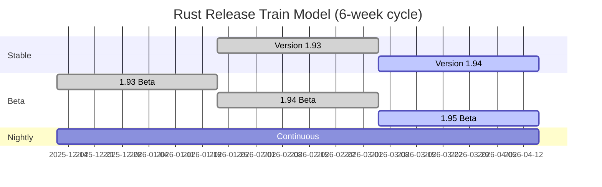

Rust follows a predictable, time-based release schedule with new stable versions released every six weeks. This document outlines the release process, versioning scheme, and what you can expect from each release.

## Release Channels

Rust maintains three release channels that represent different stages of development:

<Accordion title="Nightly">
**Daily builds with cutting-edge features**

Nightly builds are created automatically every day from the master branch. They include:
- Unstable features (requires `#![feature(...)]` gates)
- Latest bug fixes and improvements
- Experimental language features and APIs
- May contain breaking changes

```bash
rustup install nightly
rustup default nightly
```

<Warning>
Nightly builds may be unstable and are not recommended for production use.
</Warning>
</Accordion>

<Accordion title="Beta">
**Pre-release testing channel**

Every six weeks, the current nightly becomes the new beta. Beta receives:
- Bug fixes only (no new features)
- Stabilization of previously unstable features
- Final testing before stable release
- Community feedback on upcoming stable release

```bash
rustup install beta
rustup default beta
```
</Accordion>

<Accordion title="Stable">
**Production-ready releases**

Every six weeks, the current beta becomes the new stable release. Stable provides:
- Thoroughly tested features
- Guaranteed stability and backward compatibility
- Official support and documentation
- Recommended for production use

```bash
rustup install stable
rustup default stable
```
</Accordion>

## Release Cycle

Rust follows a train-based release model:



<Steps>
  <Step title="Week 0: New Nightly">
    Development begins on features for a future release. Unstable features are developed and tested on nightly.
  </Step>
  
  <Step title="Week 6: Beta Branch">
    Current nightly is branched to beta. No new features are added to beta, only bug fixes.
  </Step>
  
  <Step title="Week 12: Stable Release">
    Beta is promoted to stable. A new version is released with all features that were ready six weeks ago.
  </Step>
</Steps>

<Info>
This train model means features can take 6-12 weeks from stabilization to appearing in a stable release.
</Info>

## Versioning Scheme

Rust uses semantic versioning with the format `MAJOR.MINOR.PATCH`:

- **MAJOR** (1.x.x): Currently at version 1, rarely changes
- **MINOR** (1.x.x): Incremented every six weeks with new features
- **PATCH** (1.x.x): Bug fixes and critical updates between releases

### Recent Releases

<Accordion title="Version 1.94.0 (2026-03-05)">
**Language Improvements:**
- Stabilized additional 29 RISC-V target features (RVA22U64/RVA23U64 profiles)
- Updated to Unicode 17
- Added warn-by-default `unused_visibilities` lint
- Improved lifetime error handling for closures

**Platform Support:**
- Added `riscv64im-unknown-none-elf` as tier 3 target

**Stabilized APIs:**
- `<[T]>::array_windows`
- `<[T]>::element_offset`
- `LazyCell::get`, `LazyCell::get_mut`, `LazyCell::force_mut`
- `LazyLock::get`, `LazyLock::get_mut`, `LazyLock::force_mut`
- `f32::consts::EULER_GAMMA`, `f64::consts::EULER_GAMMA`
- `f32::consts::GOLDEN_RATIO`, `f64::consts::GOLDEN_RATIO`
</Accordion>

<Accordion title="Version 1.93.0 (2026-01-22)">
**Language Improvements:**
- Stabilized several s390x `vector`-related target features
- Stabilized `asm_cfg` for conditional assembly code
- Stabilized C-style variadic functions for `system` ABI
- Added warn-by-default `const_item_interior_mutations` lint
- Added warn-by-default `function_casts_as_integer` lint

**Compiler:**
- Stabilized `-Cjump-tables=bool` flag

**Platform Support:**
- Promoted `riscv64a23-unknown-linux-gnu` to Tier 2

**Libraries:**
- Allowed global allocator to use thread-local storage
- Improved `BTree::append` behavior
</Accordion>

<Accordion title="Version 1.92.0 (2025-12-11)">
**Language Improvements:**
- Documented `MaybeUninit` representation and validity
- Allowed `&raw [mut | const]` for union fields in safe code
- Made never type lints deny-by-default
- Allowed specifying multiple bounds for same associated item

**Libraries:**
- Specialized `Iterator::eq{_by}` for `TrustedLen` iterators
- Added details to `Debug` for `EncodeWide`
- Made `iter::Repeat::last` and `count` panic instead of looping infinitely

**Stabilized APIs:**
- `NonZero<u{N}>::div_ceil`
- `RwLockWriteGuard::downgrade`
- `Box::new_zeroed`, `Box::new_zeroed_slice`
- `Arc::new_zeroed`, `Arc::new_zeroed_slice`
- `Rc::new_zeroed`, `Rc::new_zeroed_slice`
</Accordion>

<Accordion title="Version 1.91.0 (2025-10-30)">
**Language Improvements:**
- Stabilized LoongArch32 inline assembly
- Added warn-by-default `dangling_pointers_from_locals` lint
- Added warn-by-default `integer_to_ptr_transmutes` lint
- Upgraded `semicolon_in_expressions_from_macros` to deny-by-default
- Stabilized `sse4a` and `tbm` target features

**Platform Support:**
- Promoted `aarch64-pc-windows-gnullvm` and `x86_64-pc-windows-gnullvm` to Tier 2 with host tools
- Promoted `aarch64-pc-windows-msvc` to Tier 1

**Stabilized APIs:**
- `Path::file_prefix`
- `AtomicPtr::fetch_ptr_add`, `fetch_ptr_sub`, `fetch_byte_add`, `fetch_byte_sub`
- `{integer}::strict_add`, `strict_sub`, `strict_mul`, etc.
- `PathBuf::add_extension`, `PathBuf::with_added_extension`
- `Duration::from_mins`, `Duration::from_hours`
- `BTreeMap::extract_if`, `BTreeSet::extract_if`
</Accordion>

## Stability Guarantees

Rust provides strong backward compatibility guarantees:

<Accordion title="Semantic Versioning Commitment">
**Stable Rust guarantees:**
- Code that compiles on Rust 1.x will compile on Rust 1.y where y > x
- Minor version increments (1.93 → 1.94) are always backward compatible
- Deprecations are announced with ample warning time
- Breaking changes require edition boundaries (see Editions)

**What this means:**
- Your production code won't break with stable updates
- You can safely upgrade to newer minor versions
- Security patches are backported when needed
</Accordion>

<Accordion title="Edition System">
Rust uses **editions** to make breaking changes while maintaining compatibility:

- **Rust 2015** - Original edition
- **Rust 2018** - Improved module system, NLL, async/await foundation
- **Rust 2021** - IntoIterator for arrays, disjoint capture in closures, panic macros
- **Rust 2024** - (Future edition, in development)

<Info>
You can mix crates using different editions in the same project. The compiler handles compatibility automatically.
</Info>

Specify edition in `Cargo.toml`:
```toml
[package]
edition = "2021"
```
</Accordion>

## Release Cadence Benefits

<CardGroup cols={2}>
  <Card title="Predictable Schedule" icon="calendar">
    Teams can plan upgrades around the 6-week cycle without surprises.
  </Card>
  
  <Card title="Rapid Iteration" icon="rocket">
    New features reach users quickly after stabilization.
  </Card>
  
  <Card title="Reduced Risk" icon="shield">
    Smaller, frequent releases are easier to test and rollback if needed.
  </Card>
  
  <Card title="Community Testing" icon="users">
    Beta channel allows community testing before stable release.
  </Card>
</CardGroup>

## Tracking Releases

Stay informed about Rust releases:

- **Blog**: [blog.rust-lang.org](https://blog.rust-lang.org/) - Official announcements
- **RELEASES.md**: Detailed changelog in the Rust repository
- **This Week in Rust**: [this-week-in-rust.org](https://this-week-in-rust.org/) - Weekly newsletter
- **Forge**: [forge.rust-lang.org](https://forge.rust-lang.org/) - Release calendar and process

## Compatibility Notes

Each release includes compatibility notes for potential breaking changes:

<Warning>
**Common compatibility issues:**
- Future compatibility lints becoming errors
- Lifetime inference changes
- Type system improvements that may reject previously accepted code
- Standard library behavior clarifications
</Warning>

Always review compatibility notes when upgrading, especially:
- Changes to macro behavior
- Lint level upgrades (warn → deny)
- Platform-specific changes
- MSRV (Minimum Supported Rust Version) impacts on dependencies

## Contributing to Releases

The Rust release process is community-driven:

<Steps>
  <Step title="Feature Development">
    Implement features on nightly with feature gates.
  </Step>
  
  <Step title="Stabilization">
    Propose stabilization through RFCs or stabilization reports.
  </Step>
  
  <Step title="Beta Testing">
    Test your code on beta channel and report issues.
  </Step>
  
  <Step title="Release Notes">
    Contribute to release notes and documentation.
  </Step>
</Steps>

<Info>
Anyone can contribute by testing beta releases and reporting bugs before stable release.
</Info>

## Update Best Practices

<Accordion title="For Library Authors">
1. Test on beta before stable release
2. Update MSRV conservatively
3. Document breaking changes clearly
4. Use feature flags for unstable features
5. Monitor deprecation warnings
</Accordion>

<Accordion title="For Application Developers">
1. Stay on stable channel for production
2. Update dependencies regularly
3. Test on beta to catch issues early
4. Review release notes before upgrading
5. Use `cargo update` to get compatible updates
</Accordion>

<Accordion title="For Embedded/System Developers">
1. Verify platform support tier changes
2. Test toolchain updates thoroughly
3. Pin Rust version for critical systems
4. Monitor target-specific compatibility notes
5. Participate in beta testing for your platform
</Accordion>